# Capítulo 1. Introducción

FPGA-in-the-Loop (FIL) en HDL Verifier para MATLAB/Simulink es una técnica de
verificación en la que el diseño HDL (DUT) se ejecuta en una FPGA física,
mientras Simulink se utiliza como entorno de co-simulación para aplicar
estímulos y recoger respuestas.

En este esquema, el objetivo es validar el comportamiento del HDL implementado
ya en FPGA, en un entorno simulado más cercano a la realidad usando herramientas
de MATLAB y Simulink. Esto permite comprobar funcionalidad, latencias y
sincronización con señales de prueba antes de integrar el diseño en un sistema
final.

## Estructura de un flujo FIL

Un flujo FIL típico incluye:

- El DUT implementado en la FPGA y un bloque FIL en Simulink que actúa como
  interfaz de I/O.
- Un canal de comunicación entre Simulink y la FPGA (Ethernet, JTAG o PCIe,
  según la tarjeta).
- Un modelo de prueba en Simulink que genera estímulos, sincroniza el muestreo y
  observa las salidas.

## Licencias y herramientas necesarias

Para ejecutar FIL se requieren licencias activas de:

- MATLAB y Simulink.
- HDL Verifier (incluye el `FIL Wizard` y el bloque FIL).
- HDL Coder, si el HDL se genera desde Simulink.
- Herramienta del fabricante para sintetizar y generar el bitstream (p. ej.,
  Vivado para AMD/Xilinx o Quartus para Intel), junto con sus *support packages*
  cuando aplique.

# Capítulo 2. Flujo operativo del asistente FIL

## Iniciar el asistente

1. En MATLAB, ejecute: `>> filWizard`.

   Llamada al asistente FIL desde la consola de MATLAB.

   

   Pantalla inicial del asistente FIL.

   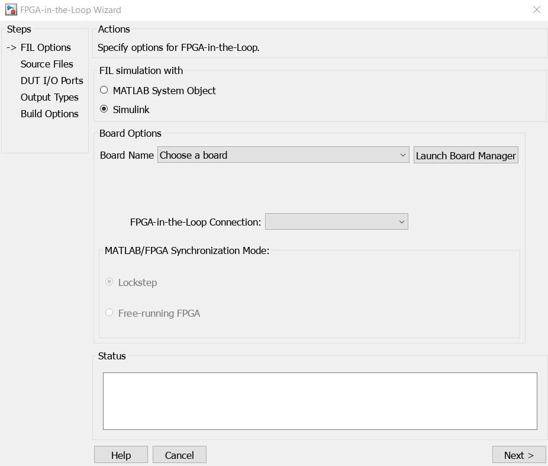

2. Elija **Simulink** como entorno de simulación.
3. Seleccione la tarjeta de desarrollo FPGA. Se recomienda instalar *HDL Verifier
   Support Package for AMD FPGA and SoC Devices* y *HDL Verifier Support Package
   for Intel FPGA Boards* para contar con más FPGAs predefinidas.
4. Defina el método de conexión soportado (Ethernet, JTAG, PCI Express o USB
   Ethernet) según la compatibilidad de la tarjeta y de HDL Verifier.

Dependiendo de la FPGA y el tipo de conexión, MATLAB se puede conectar con la
FPGA en dos modos:

- **Lockstep (modo predeterminado):** La FPGA opera en sincronía con
  MATLAB/Simulink. Cada paso de simulación produce un ciclo de reloj en el
  hardware, logrando simulación ciclo a ciclo.
- **Free-Running:** La FPGA corre con su reloj interno y procesa datos de forma
  continua. MATLAB/Simulink solo intercambia datos bajo demanda y no gobierna
  los ciclos de reloj. Este modo solo está disponible en ciertas tarjetas y
  conexiones Ethernet.

## Configuración de la FPGA

En esta etapa se definen los parámetros de la FPGA para que el FIL Wizard pueda
generar y programar el diseño. En **Board name** se listan opciones predefinidas;
si su FPGA no aparece, debe crearla desde **Create custom board** al final de la
lista.

Ventana inicial del FIL Wizard.

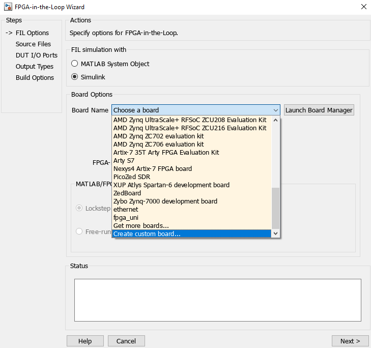

Asistente de nueva placa FPGA.

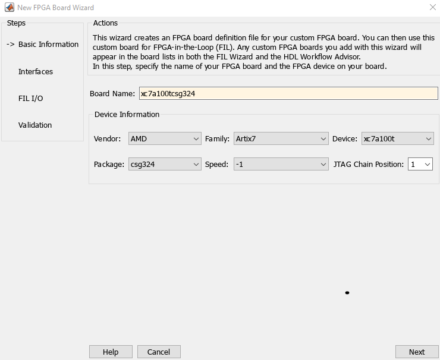

Luego se define la interfaz con la que se conectará la FPGA. En este documento
se utiliza **JTAG**, por lo que no se profundiza en las demás opciones; estas
requieren que la FPGA tenga la interfaz física disponible o que se implemente en
el diseño.

En **FPGA input clock** se debe ingresar la frecuencia del reloj esperado. En
este caso se usa **100 MHz**; esta es la restricción con la que se sintetiza e
implementa el diseño. Si el diseño no cumple temporización para esta frecuencia,
la implementación fallará.

Selección de interfaz y frecuencia de reloj.

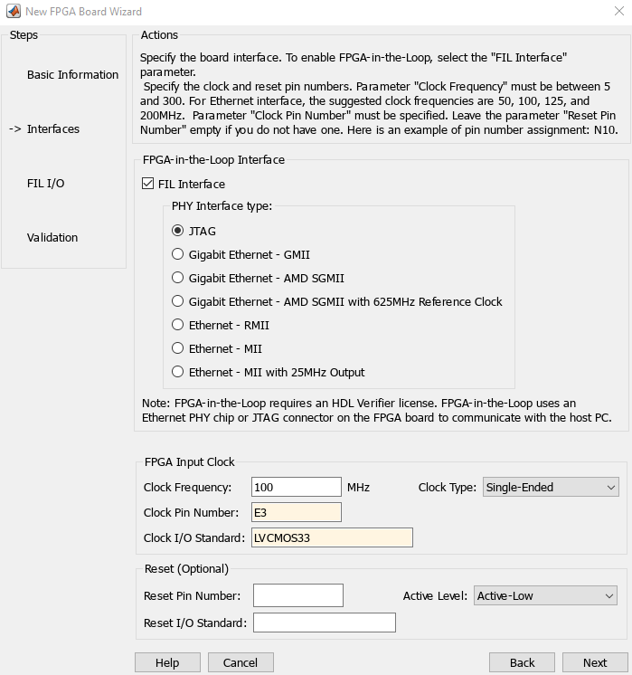

En la opción de cadena JTAG, continúe con *Next* a menos que el JTAG no esté
conectado directamente a la FPGA, es decir, si hay otros dispositivos en serie
antes o después de la FPGA.

Por último, se abre una ventana para validar la conexión con la FPGA. Se
recomienda activar las dos casillas y ejecutar la prueba. Si finaliza con éxito,
la configuración es correcta para usar el FIL Wizard.

Validación de conexión con la FPGA.

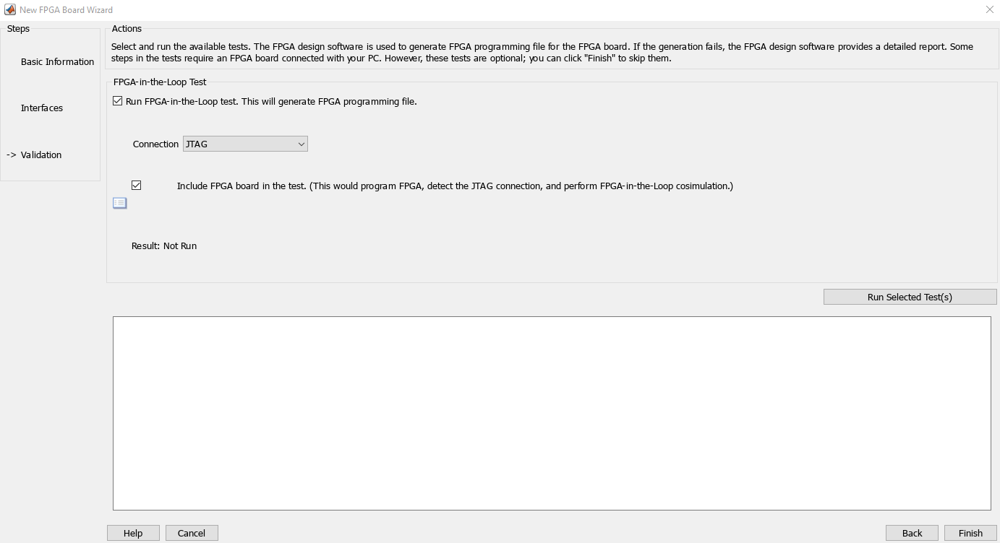

## Selección de fuentes HDL y configuración

Añadir archivos HDL.

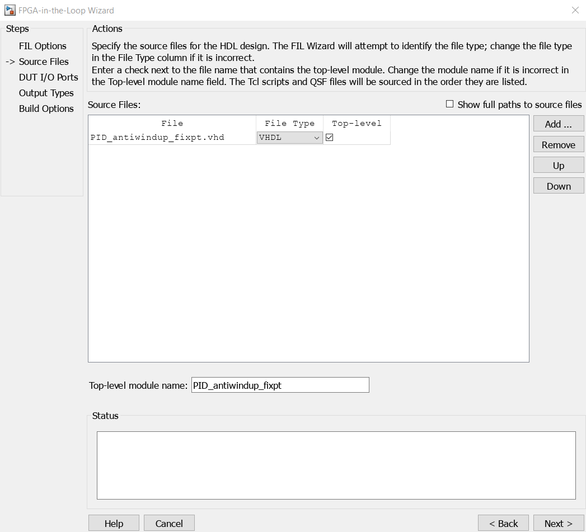

Tabla de puertos detectados.

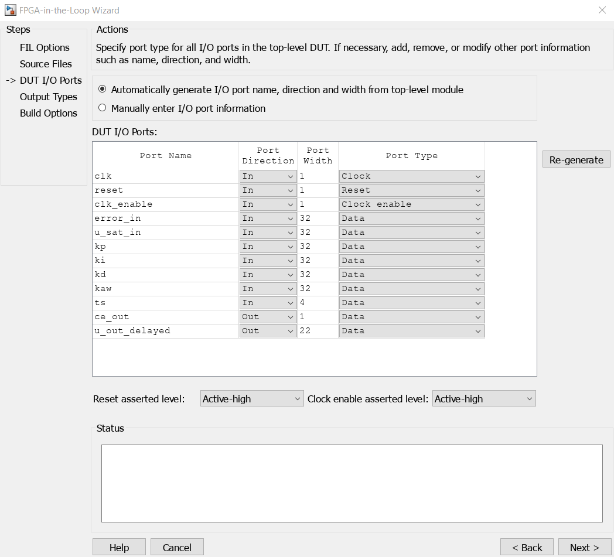

Configuración de salidas.

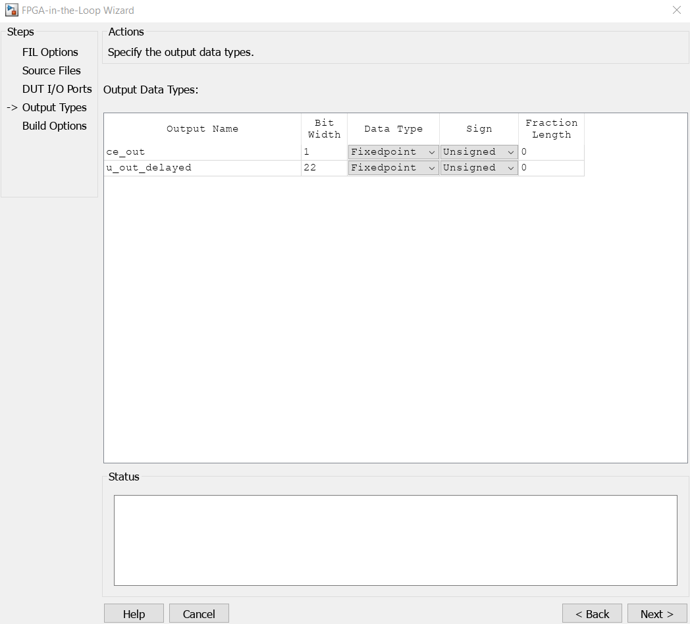

1. Añada los archivos HDL y declare el *top* del diseño.
2. Revise la tabla de puertos del DUT; el asistente analiza el módulo superior y
   muestra todas las E/S detectadas. Para entradas se contemplan cuatro casos:
   *clock*, *reset*, *clock enable* o *data*. Los tres primeros no generan puerto
   visible en el bloque FIL (se cablean internamente); las salidas solo pueden
   ser de tipo *data*. Los parámetros *reset asserted level* y
   *clock enable asserted level* dependen de si el diseño usa flanco positivo o
   negativo para reset y habilitación.
3. Ajuste manualmente cualquier discrepancia de tipo o tamaño en los puertos.

## Tipos de salida

- Defina el tipo de dato que entregará el bloque FIL hacia Simulink: punto fijo,
  entero o lógico.
- Si detecta un tipo incorrecto, corríjalo manualmente antes de la generación;
  las salidas pueden modificarse después, pero las entradas no.

## Construcción del bloque FIL

Generación del bloque FIL desde el asistente.

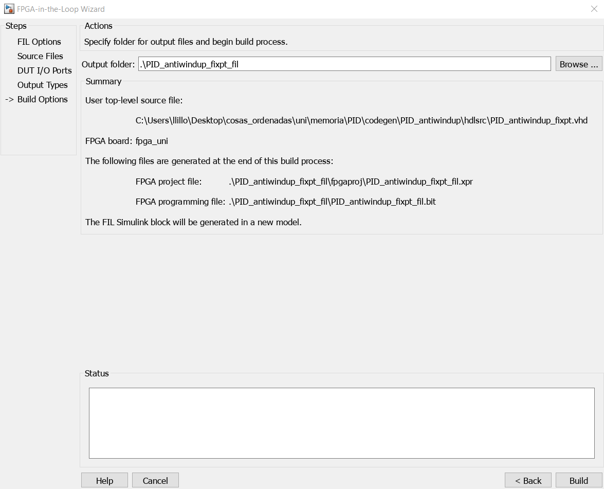

1. Indique la carpeta de salida para los artefactos generados.
2. Pulse **Build** para lanzar la generación del bloque FIL y el bitstream.
3. Una vez completada la síntesis, se abrirá un modelo de Simulink con el bloque
   FIL listo para integrar.
4. MATLAB debe tener en el *path* la ubicación del binario de Vivado/Altera.
   Ejemplo para agregarlo:
   `hdlsetuptoolpath('ToolName','Xilinx Vivado','ToolPath','C:\Xilinx\Vivado\2023.1\bin\vivado.bat');`
   (ajuste la versión según la instalada).

## Integración en Simulink

- Al terminar la síntesis se crea un bloque FIL en Simulink y, en paralelo,
  inicia la implementación y generación del bitstream.
- Cargue el bitstream en la FPGA cuando el modelo se lo solicite.
- Conecte el bloque FIL al resto del diagrama y ejecute la simulación en el modo
  elegido.

## Reportes de interés

Los reportes de síntesis e implementación se encuentran en la carpeta
`project_name_fil`. Este nombre es el predeterminado del asistente y puede
modificarse en la última etapa del *FIL Wizard*; por defecto `project_name`
coincide con el nombre del *top* HDL. Por ejemplo, en
`project_name_fil.runs/impl_1/project_name_fil_utilization_placed.rpt` se
detalla la cantidad de LUT usadas. Se debe tener en cuenta que este conteo
contempla tanto el módulo como el *wrapper* necesario para utilizar el módulo
con FIL. Además, en
`project_name_fil.runs/impl_1/project_name_fil_utilization_placed.rpt` se puede
revisar el *timing*, que verifica si para la frecuencia de reloj designada la
FPGA cumple la temporización.

En `project_name_fil/project_name_fil.runs/synth_1/runme.log` existe una sección
*Report Cell Usage* similar a la de implementación, pero en síntesis se listan
los módulos del *wrapper* como módulos sin contar sus LUTs, lo que permite una
mejor idea del consumo por módulo. Al tratarse de síntesis, estos valores pueden
cambiar al pasar a implementación.

Sección *Report Cell Usage* en síntesis.

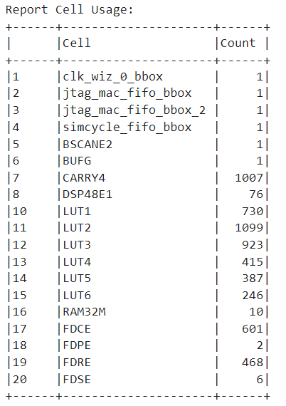

Sección *Report Cell Usage* en implementación.

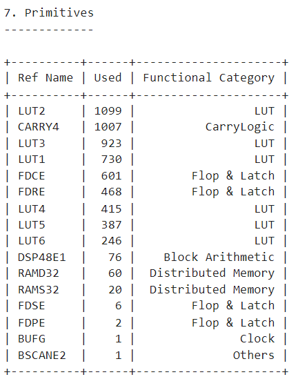

# Capítulo 3. Bloque FIL en Simulink

## Bloque FIL en Simulink: uso y conexión

El bloque FIL generado por el asistente se inserta en el modelo de Simulink y se
gestiona mediante dos pestañas principales. La imagen siguiente muestra la
interfaz general.

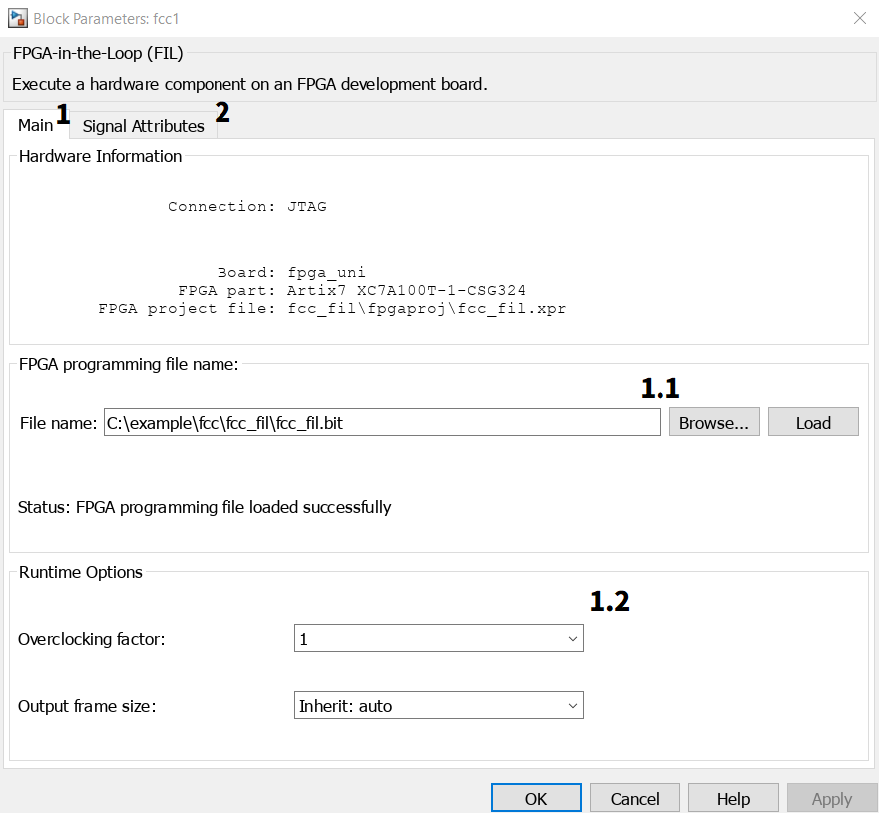

### Pestaña *Programming File*

- Cargue el bitstream generado al finalizar `filWizard` mediante la opción
  *Load*. La carga puede tardar varios minutos según el tamaño y la complejidad
  del bitstream.
- Espere a que concluya la programación antes de iniciar la simulación para
  evitar desalineaciones entre hardware y modelo.

### Pestaña *Runtime Options*

#### Overclocking Factor

Configure cuántos ciclos de reloj de hardware se ejecutan por cada paso de
simulación. Si el diseño HDL requiere $n$ ciclos internos para producir una
salida por cada entrada, establezca el *overclocking factor* en $n$. Un ejemplo
práctico se describe en el apartado de overclocking del contador.

- Un factor insuficiente produce datos incompletos o inestables.
- Un factor excesivo introduce latencia adicional; en diseños con
  retroalimentación puede provocar acumulación de valores. Emplee señales
  `valid/ready` en el HDL para cortar el procesamiento cuando la operación ya
  finalizó.

#### Output Frame Size

Controla el tamaño de la trama de salida cuando se trabaja en modo *frame-based*.
Permite alinear la cantidad de muestras emitidas por el bloque FIL con el ritmo
esperado por el modelo aguas abajo. Internamente, se ajusta al sobre-reloj y al
posible *downsample* de salida. Mantenga el valor por defecto cuando se trabajen
señales escalar o *sample-based*; ajuste solo si el modelo requiere tramas de
longitud específica.

### Atributos de señal

Configuración de atributos de señal en el bloque FIL.

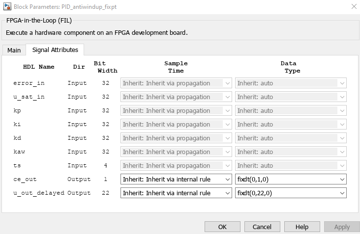

- **Sample time:** seleccione *inherit via propagation* para heredar el tiempo
  de muestreo desde el bloque conectado; *inherit via internal rule* establece
  salidas continuas si alguna entrada es continua, y salidas discretas si todas
  las entradas son discretas. También puede fijar un valor explícito
  (p. ej., `1e-3`).
- **Data type:** declare el tipo de dato de cada salida para que Simulink
  interprete correctamente la señal. Defina punto fijo o lógico cuando sea
  posible para trazabilidad y equivalencia con hardware.
- Las entradas se definen durante el asistente FIL; en el bloque solo se
  configuran salidas.

## Ritmo de simulación y reloj del bloque FIL

- Por defecto, un paso de Simulink equivale a un ciclo de reloj del bloque FIL;
  en cada paso se leen salidas y se aplican nuevas entradas.
- Si el HDL necesita más de un ciclo para producir una salida, configure
  *overclocking factor* igual al número de ciclos internos requeridos. Esto
  evita submuestreo de la lógica.
- **Latencia (ciclos):** ciclos transcurridos desde la entrada hasta la salida.
  **Throughput:** resultados por ciclo. **Intervalo de iniciación (II):** número
  de ciclos entre entradas sucesivas; $\text{Throughput} = 1 / \text{II}$.
- Use señales `valid/ready` en diseños con caminos de realimentación para frenar
  el procesamiento cuando la operación ha concluido, especialmente si el factor
  de sobre-reloj excede la latencia real.

## Sample times y modos de simulación

### Entradas discretas y errores comunes

El bloque FIL es discreto. Si recibe una entrada continua, Simulink mostrará un
error como en la imagen siguiente. Defina un tiempo de muestreo en la ruta de
entrada (p. ej., *Zero-Order Hold* o *Unit Delay*).

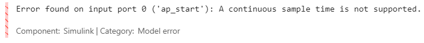

Si una entrada tiene un sample time mínimo de $T_\text{in}$ y el paso de
simulación es menor, el bloque FIL toma datos a $T_\text{in}$, usando el menor
tiempo de muestreo entre sus entradas como reloj efectivo.

Si se necesita conectar el FIL con un sistema continuo en Simulink, se puede
usar un *Zero-Order Hold* para simular un DAC junto con un bloque
*Data Type Conversion* que convierta la salida a `double`. En sentido inverso,
use otro *Data Type Conversion* para ajustar desde `double` al tipo de dato de
entrada del FIL, junto con un *Zero-Order Hold* para simular un ADC.

### Fixed-step vs. variable-step

- **Fixed-step:** recomendado para evitar desincronización. El overclocking debe
  ser múltiplo del paso fijo.
- **Variable-step:** necesario con dinámicas continuas. Todas las entradas al FIL
  deben estar discretizadas. Use *Zero-Order Hold* para entradas continuas,
  *Unit Delay* en la realimentación al propio FIL y, si la salida alimenta un
  bloque continuo, coloque un *Zero-Order Hold* en esa ruta. Mantenga el paso
  variable más pequeño que los sample times de entrada y de salida para
  preservar exactitud.

## Tipos de datos y conversión de buses

El bloque FIL acepta buses de señales; no admite matrices como entrada. Si el
ancho del bus no coincide con el de la señal, se produce un error como en la
imagen siguiente.

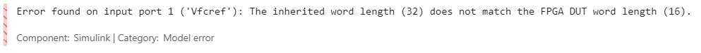

Para adaptar tipos, use el bloque *Data Type Conversion*. Configure el tipo de
salida como `fixdt` o lógico según corresponda. Ejemplos:

- `fixdt(1, 32, 0)` equivale a `int32`.
- `fixdt(0, 16, 0)` equivale a `uint16`.
- `fixdt(1, 16, 8)` es un punto fijo con signo de 16 bits y 8 bits fraccionarios.

Para los límites generales de tamaño y coherencia de señal, consulte la sección
sobre restricciones.

Uso del bloque *Data Type Conversion*: conversión de entrada (izquierda) y
parámetros de salida (derecha).

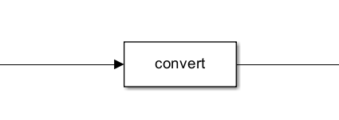

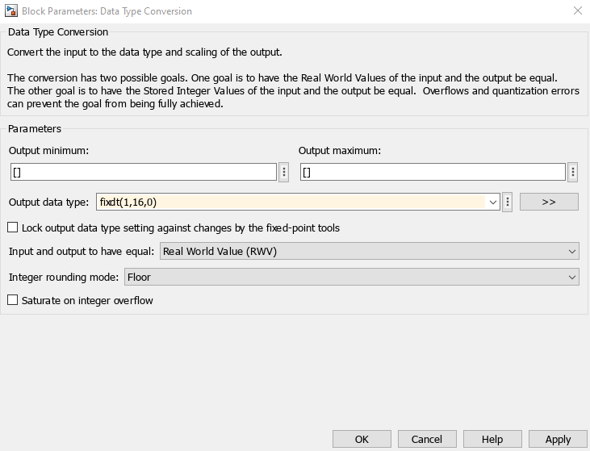

Si una salida del bloque FIL se retroalimenta a una entrada, inserte un
*Zero-Order Hold* o un *Unit Delay* en ese lazo. Simulink no permite un ciclo
directo con un bloque discreto sin discretizar la ruta de realimentación, por lo
que es obligatorio introducir ese elemento para cerrar el lazo.
