# Introducción al uso de HDL Coder en MATLAB

HDL Coder de MATLAB se utiliza como una herramienta clave para la **implementación de algoritmos en hardware digital**, permitiendo la generación automática de código HDL (VHDL o Verilog) a partir de modelos desarrollados y verificados en MATLAB o Simulink. Su objetivo principal es reducir la brecha entre el diseño algorítmico de alto nivel y su realización eficiente en FPGA o ASIC.

El uso de HDL Coder aporta múltiples ventajas en entornos de diseño profesional:

- **Reducción del tiempo de desarrollo**: al automatizar la generación de código HDL, se disminuye significativamente el esfuerzo requerido frente a la codificación manual en RTL.
- **Mayor confiabilidad del diseño**: el HDL se genera a partir de modelos previamente simulados y validados, lo que reduce errores de interpretación del algoritmo y mejora la consistencia entre especificación e implementación.
- **Facilidad de verificación y validación**: permite comparar los resultados del modelo original con el comportamiento del hardware generado, favoreciendo procesos de verificación más estructurados.
- **Control de la arquitectura hardware**: ofrece mecanismos para definir latencias, pipeline, paralelismo y utilización de recursos, aspectos críticos en diseños digitales de alto desempeño.
- **Soporte para aritmética de punto fijo**: facilita la transición desde modelos en punto flotante hacia implementaciones en punto fijo, optimizadas para síntesis en hardware.
- **Integración con flujos industriales**: el código generado puede integrarse en proyectos existentes y es compatible con herramientas estándar de síntesis y verificación.

## Alcance del documento

El presente documento tiene como objetivo **facilitar el uso de HDL Coder** a usuarios que comienzan a trabajar con esta herramienta, proporcionando una guía práctica basada en **consejos útiles y buenas prácticas**. Su enfoque está orientado a ayudar al lector a comprender los aspectos fundamentales del flujo de trabajo, evitar errores comunes en las primeras etapas y adoptar criterios de diseño que favorezcan una implementación eficiente y verificable en hardware.

Este material no pretende reemplazar la documentación oficial de MathWorks, sino servir como un **complemento introductorio** orientado a la experiencia práctica. Para una descripción completa y detallada de la herramienta, se recomienda consultar la documentación oficial de HDL Coder disponible en  
https://www.mathworks.com/help/hdlcoder/index.html  
así como la guía de inicio  
https://www.mathworks.com/help/hdlcoder/getting-started-with-hdl-coder.html,  
donde se presentan los conceptos fundamentales, ejemplos y flujos de trabajo recomendados por el fabricante.

## Estructura y flujo de trabajo

A continuación, se presenta un **diagrama de flujo** que indica la **secuencia del uso de HDL Coder con workflow advisor** dentro del proceso de diseño. Este diagrama resume las principales etapas del flujo de trabajo, desde el desarrollo y validación del modelo hasta la generación de código HDL. 

En las secciones posteriores del documento, **cada uno de los puntos del diagrama será explicado en detalle**, justificando su propósito dentro del flujo de diseño y describiendo las razones por las cuales se recomienda seguir dicha secuencia para obtener implementaciones más eficientes, verificables y mantenibles.


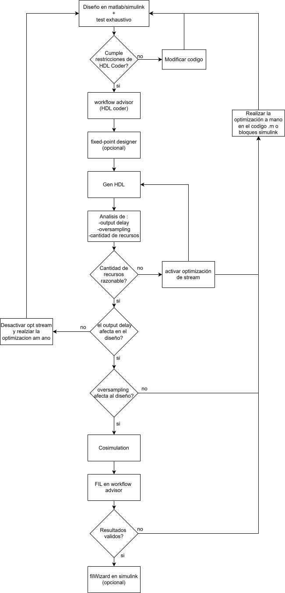

Tal como se muestra en el diagrama, es necesario contar inicialmente con un **diseño en MATLAB o Simulink acompañado de un test exhaustivo del sistema**, con el fin de verificar su correcto funcionamiento antes de avanzar hacia etapas posteriores del flujo de diseño en hardware.

Para comenzar se utilizará un ejemplo sencillo en MATLAB correspondiente al **cálculo del producto punto entre dos vectores**, disponible en `examples/Producto_punto`. Este primer caso sigue un flujo limpio y sin errores, por lo que sirve para introducir la herramienta. Más adelante se presentará un caso con problemas de implementación para discutir buenas prácticas y criterios de diseño.

El ejemplo está escrito de forma simple y clara, lo que facilita su análisis y su adaptación al flujo de HDL Coder:

```matlab
function p = producto_punto(Vector_a, Vector_b)
% PRODUCTO_PUNTO_VECTORES Calcula el producto punto entre dos vectores

    p = Vector_a.' * Vector_b;

end
```
Una vez definido el algoritmo, es fundamental testearlo con una gran variedad de valores de entrada. Esto es especialmente importante cuando se planea utilizar herramientas como Fixed-Point Designer, ya que dicha herramienta toma como referencia los valores máximos y mínimos observados durante la simulación para determinar los rangos y la cantidad de recursos necesarios en la implementación hardware.

Si el hardware generado es posteriormente utilizado con valores que provoquen acumulaciones mayores o magnitudes superiores a las consideradas durante el test inicial —ya sea en las entradas o en variables internas— pueden aparecer errores por desbordamiento o pérdida de información debido a saturación. Por este motivo, un test amplio y representativo resulta crítico.

A continuación, se presenta un ejemplo de test que genera múltiples casos aleatorios:

<details>
<summary>Ver test completo del producto punto</summary>

```
% test_producto_punto_vectores.m
% Test: 1000 casos aleatorios para producto_punto_vectores

rng(0);                % Semilla para reproducibilidad (opcional)
N = 1000;              % Cantidad de ejemplos

% Golden reference (prealocar)
golden.Vector_a = zeros(3, N);
golden.Vector_b = zeros(3, N);
golden.p        = zeros(1, N);

for k = 1:N
    % Vectores 3x1 con valores uniformes entre 0 y 100
    Vector_a = 100 * rand(3,1);
    Vector_b = 100 * rand(3,1);

    p = producto_punto(Vector_a, Vector_b);

    % Guardar entradas y salida
    golden.Vector_a(:, k) = Vector_a;
    golden.Vector_b(:, k) = Vector_b;
    golden.p(k)           = p;
end

% Guardar a archivo .mat
save('golden_reference_producto_punto.mat', 'golden');
```

</details>

Tal como se observa en el código, además de realizar el test del algoritmo, se recomienda almacenar los valores de entrada y salida. De esta manera, si posteriormente se desea probar la implementación en Simulink bajo las mismas condiciones, se dispone de una referencia guardada en un archivo .mat, que puede utilizarse directamente mediante el bloque From Workspace. Esto facilita la validación cruzada entre MATLAB, Simulink y el HDL generado.

## Workflow Advisor: configuración y generación de HDL

A continuación se describe el flujo práctico dentro de HDL Coder una vez que ya se dispone del diseño en MATLAB y su testbench correspondiente.

### Capacidades clave de HDL Coder

Antes de entrar al paso a paso, conviene tener claras las capacidades que aporta la herramienta dentro del flujo:

- Generación de código HDL sintetizable (VHDL/Verilog) desde funciones MATLAB y modelos Simulink/Stateflow.
- Generación automática de testbench y de modelos para co-simulación.
- Reportes HTML de recursos, optimizaciones y conformidad HDL.
- Trazabilidad entre modelo y código generado para depuración y revisión.
- Integración con HDL Verifier para validación por cosimulación y FPGA-in-the-Loop (FIL).
- Opciones de optimización de arquitectura (sharing, stream loops, pipeline), con impacto directo en área, latencia y frecuencia.

Estas capacidades aceleran el prototipado, pero no reemplazan el criterio de diseño: la calidad final depende de cómo esté modelado el algoritmo y de la configuración elegida en el workflow.

### Apertura del Workflow Advisor

El Workflow Advisor puede abrirse desde el icono correspondiente:


También es posible iniciarlo desde la consola con el comando `hdlcoder`. En ambos casos se abre la siguiente ventana:

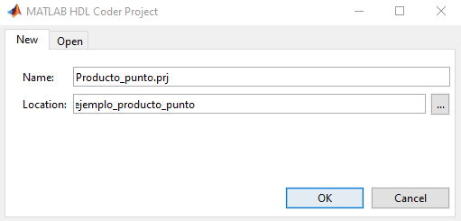

Se presiona **OK** y se abrirá la siguiente pantalla:


En **Add MATLAB function** se selecciona la función a convertir a HDL, y en **Add files** se agrega el test. Con ello se puede avanzar a **Workflow Advisor**. Antes de continuar se puede ejecutar **Autodefine types**, pero esta acción también se ejecuta dentro del flujo del Workflow, por lo que puede omitirse.

### Selección del flujo y tipos

En la siguiente ventana se decide si el flujo será hacia HLS (System C) o hacia HDL. En este caso se selecciona HDL. En **Fixed-Point Conversion** puede elegirse **Keep original types**, lo que mantiene los tipos de entrada originales. Sin embargo, si las entradas son `double` o `single`, la utilización de recursos se incrementa de forma significativa. Por ello se recomienda **Convert to fixed-point at build time**. Aun así, se mostrará la configuración para trabajar con punto flotante si fuese necesario.

En **Define Input Types** basta con ejecutar **Run** para que se ejecute el test y se determinen los rangos de entrada. Luego se pasa a **Fixed-Point Conversion**. Al ingresar, se espera hasta ver la siguiente ventana:


En (1) se selecciona si la herramienta recomendará el tamaño en bits o la precisión en decimales. Si se conoce la precisión deseada en decimales, puede elegirse esa opción. Como aproximación práctica, si se desea conservar `d` decimales, la cantidad de bits fraccionales puede estimarse como `F ≈ ceil(d * log2(10))`; de forma equivalente, para `F` bits fraccionales se obtiene aproximadamente `d ≈ floor(F * log10(2))` decimales. Luego se presiona **Analyze** (2) para que la herramienta analice los máximos y mínimos observados durante la simulación y proponga los tamaños.

Una vez ejecutado, se mostrará lo siguiente:


Aquí se observa el mínimo y máximo detectado durante la simulación, tanto en las entradas como en las salidas. En diseños más complejos también pueden aparecer variables internas. Este punto es importante: cuando se usa conversión a **fixed-point**, los tipos propuestos por la herramienta dependen directamente de los valores que vea durante el testbench. Es decir, si en la simulación una entrada solo tomó valores pequeños, HDL Coder puede proponer un ancho menor al realmente necesario para otros casos no probados.

En la práctica, esto significa que el testbench no solo sirve para validar funcionalmente el algoritmo: también influye en los rangos que la herramienta usa para recomendar el número de bits de entradas, salidas y variables internas. Si después el hardware se utiliza con valores mayores a los observados en la simulación, pueden aparecer saturaciones, desbordamientos o pérdida de información, aunque el diseño haya funcionado correctamente durante el análisis inicial.

Por eso, el testbench debe ser lo más representativo posible del caso real. Si se sospecha que en operación habrá valores más grandes, más pequeños o con mayor precisión fraccional que los usados en el test, esos casos deben incluirse antes de aceptar los tipos recomendados.

De todas formas, los tipos no quedan fijados obligatoriamente por el testbench. En la columna **Proposed Type** es posible modificar manualmente el tipo sugerido y forzar el ancho que se desee para cada señal. El formato es `numerictype(signo, bits_totales, bits_fraccionales)`. Por ejemplo, `numerictype(1,30,14)` corresponde a un valor con signo, de 30 bits totales, de los cuales 14 se usan para la parte fraccional. Si `signo = 1`, el tipo es con signo; si `signo = 0`, es sin signo.

En este ejemplo se seleccionó un tipo fixed `(1,30,14)`, que indica un valor con signo de 30 bits, de los cuales 14 se usan para la fracción.

Luego se ejecuta **Validate Types** en la parte superior. Cuando termine, se recomienda ejecutar **Test Numerics** con las siguientes opciones:

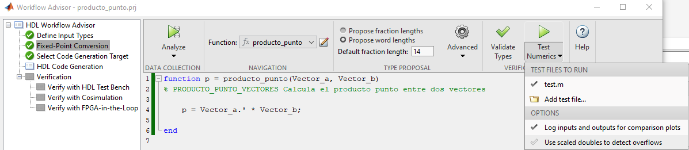

Esto generará un gráfico comparando las salidas del test original y del test con el diseño convertido a fixed-point. Permite detectar si hubo pérdida de información al pasar a punto fijo.

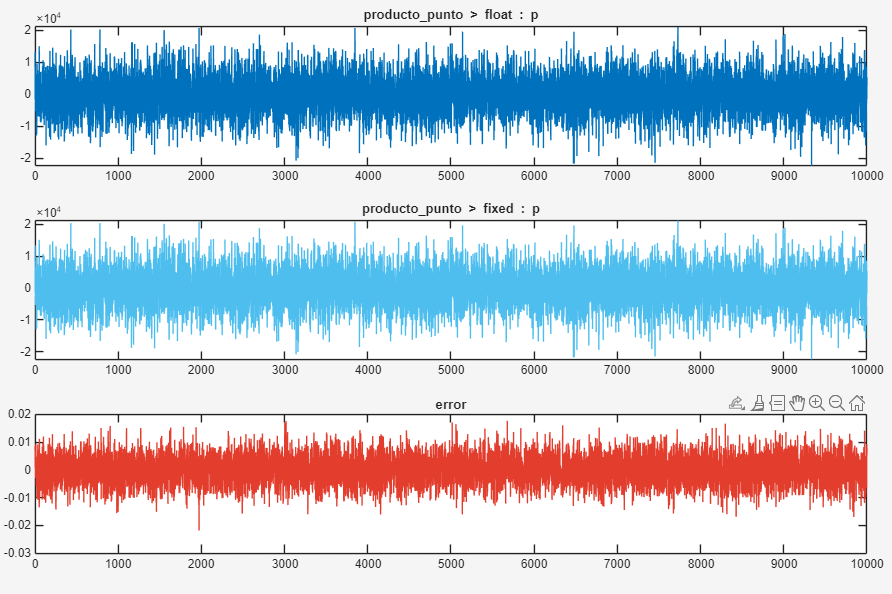

En el gráfico se aprecia un error del orden de 1e-2. En fixed-point la pérdida de precisión fraccional es habitual, pero al aumentar los bits dedicados a la fracción se reduce el orden de magnitud del error. En casos sin fracciones, fixed-point puede llegar a error 0.

### Generación de código HDL

Se continúa a **HDL Code Generation**:


Se recomienda:

- Usar lenguaje Verilog (requiere menos configuración).
- Activar la generación de todos los reportes.

En **Clocks & Ports**:

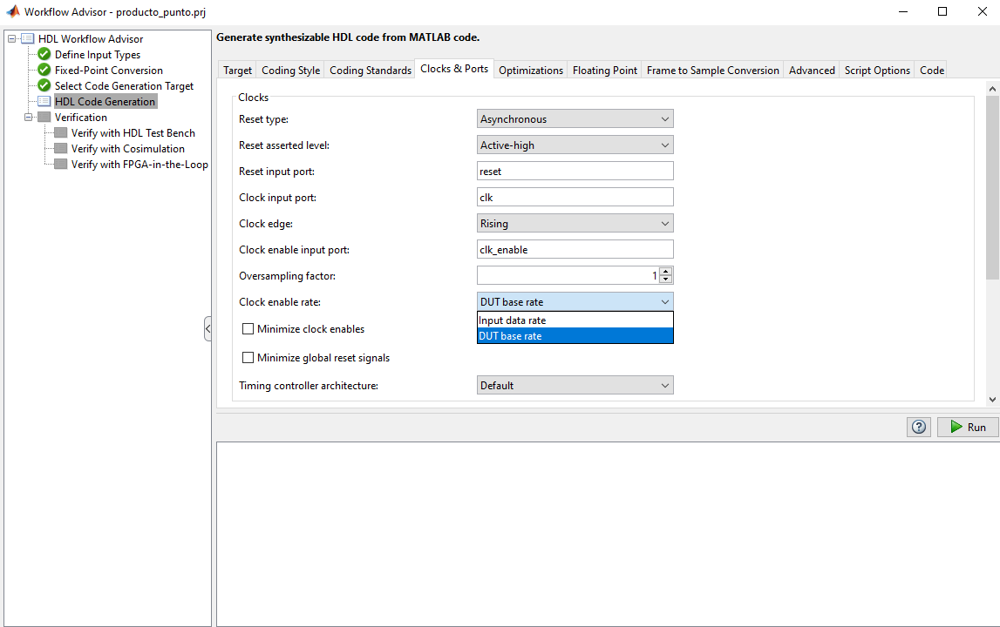

Se debe activar **DUT base rate** (por defecto **Input data rate**) para poder realizar co-simulación.

En **Optimization** se recomienda, como primer intento, activar **Stream loops**, lo que permite compartir recursos en iteraciones (por ejemplo en bucles `for`). Para diseños complejos con bucles anidados o muchas iteraciones, la herramienta puede no optimizar correctamente y es necesario modificar el diseño `.m`. En ejemplos simples como este no es imprescindible.


Con esto se puede ejecutar **Run** y generar HDL. Esto produce una salida en la ventana con mensajes importantes, por ejemplo:

```
### Begin MATLAB to HDL Code Generation...
### Working on DUT: producto_punto_fixpt.
### Using TestBench: test.
### The DUT requires an initial pipeline setup latency. Each output port experiences these additional delays.
### Output port 1: 1 cycles.
 ### MESSAGE: The design requires 3 times faster clock with respect to the base rate = 1.
### Working on producto_punto_fixpt_tc as producto_punto_fixpt_tc.v.
### Begin Verilog Code Generation
### Working on producto_punto_fixptp3 as producto_punto_fixptp3.v.
### Working on producto_punto_fixpt as producto_punto_fixpt.v.
### Generating Resource Utilization Report resource_report.html.
 ### Generating Optimization report  
 ### To rerun codegen evaluate the following commands...

---------------------
cgi    = load('examples\Producto_punto\codegen\producto_punto\hdlsrc\codegen_info.mat');
cfg    = cgi.CodeGenInfo.codegenSettings;
fxpCfg = cgi.CodeGenInfo.fxpCfg;
codegen -float2fixed fxpCfg -config cfg -report
---------------------

 ### Generating HDL Conformance Report producto_punto_fixpt_hdl_conformance_report.html.
### HDL Conformance check complete with 0 errors, 1 warnings, and 1 messages.
 ### Code generation successful: View report
### Elapsed Time: '         15.2745' sec(s)
```

- `Output port 1: 1 cycles.` indica un desfase de 1 ciclo entre la entrada y la salida. Cuando entren los vectores A y B, la salida corresponde a A-1 y B-1.
- `MESSAGE: The design requires 3 times faster clock with respect to the base rate = 1.` indica que, al usar **Stream loops**, la herramienta compartió recursos y decidió usar un solo multiplicador, realizando el calculo en 3 ciclos en lugar de 1 con 3 multiplicadores.
- `Generating Resource Utilization Report resource_report.html.` es un reporte clave, pues permite evaluar si el uso de recursos es compatible con la FPGA objetivo.

Finalmente, el reporte de recursos puede verse, por ejemplo:


Aquí se observa que se utilizó un solo multiplicador, a pesar de que un producto punto de vectores 3x1 requiere 3 multiplicaciones. El conteo de sumadores, registros y multiplexores suele ser más difícil de analizar, ya que la conversión a HDL agrega lógica adicional para control y temporización.

### Generación sin Stream loops

A continuación se repite la generación de HDL, pero desactivando **Stream loops**:

```
### Begin MATLAB to HDL Code Generation...
### Working on DUT: producto_punto_fixpt.
### Using TestBench: test.
### Begin Verilog Code Generation
### Working on producto_punto_fixpt as producto_punto_fixpt.v.
### Generating Resource Utilization Report resource_report.html.
### Generating Optimization report  
### To rerun codegen evaluate the following commands...

---------------------
cgi    = load('C:\examples\Producto_punto\codegen\producto_punto\hdlsrc\codegen_info.mat');
cfg    = cgi.CodeGenInfo.codegenSettings;
fxpCfg = cgi.CodeGenInfo.fxpCfg;
codegen -float2fixed fxpCfg -config cfg -report
---------------------

### Generating HDL Conformance Report producto_punto_fixpt_hdl_conformance_report.html.
### HDL Conformance check complete with 0 errors, 0 warnings, and 0 messages.
 ### Code generation successful: View report
### Elapsed Time: '            5.1107' sec(s)
```

Ahora no aparecen los mensajes `Output port 1: 1 cycles` ni `MESSAGE: The design requires 3 times faster clock with respect to the base rate = 1`. Esto se debe a que, al no aplicar optimizaciones, se genera un HDL puramente combinacional sin requerir reloj. Usualmente esto consume más recursos pero es más rápido. En este ejemplo, la diferencia de utilización es pequeña porque el diseño es muy reducido.

Si en lugar de 3 iteraciones se tuvieran 10.000 o 100.000 (como es común en casos reales), sería necesario compartir recursos; de lo contrario el diseño no cabría en una FPGA.

### Optimización de área (guía práctica)

En términos prácticos, la optimización de área en HDL Coder se apoya principalmente en compartir hardware entre operaciones equivalentes y en reducir paralelismo innecesario. Para diseños que crecen rápido en recursos, estas reglas suelen ayudar:

- Priorizar estructuras seriales cuando el requisito de throughput lo permita.
- Favorecer aritmética simple y evitar operaciones costosas si existe una formulación equivalente.
- Limitar arreglos y matrices grandes cuando no son estrictamente necesarios.
- Migrar de floating-point a fixed-point de forma controlada y validada.
- Usar `stream loops` y `SharingFactor` cuando se busque N-a-1 en recursos equivalentes.

Es importante considerar el costo de esta estrategia: al compartir recursos, el diseño suele requerir multiplexación adicional y una frecuencia interna mayor. En otras palabras, se reduce área, pero se tensiona más el cumplimiento de timing. Por eso, la optimización de área debe evaluarse junto con latencia y frecuencia objetivo, no de forma aislada.

### Generación en punto flotante

Se repite el proceso para punto flotante. En el **HDL Workflow Advisor**, en lugar de **Convert to fixed-point at build time** se selecciona **Keep original types**, lo que salta la etapa de fixed-point:

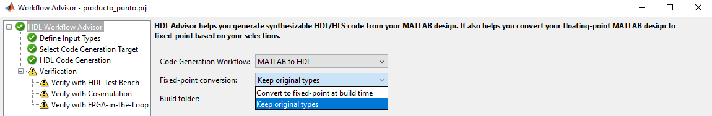

Luego se activan estas opciones de configuración para la generación de HDL, en el siguiente orden:

1) En **Optimization**, habilitar **Aggressive Dataflow Conversion**:


2) En **Advanced**, establecer **None** en **Check for presence of reals in the generated code**:


3) En **Floating Point**, activar **Use floating point** y seleccionar **NativeFloatingPoint**:

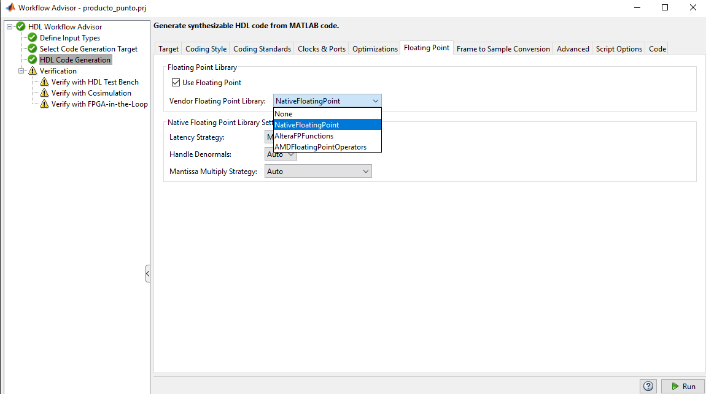

Ejecutando la generación de HDL en punto flotante con **Stream loops** activado, se obtiene la siguiente salida:

```
### Begin MATLAB to HDL Code Generation...
### Working on DUT: producto_punto.
### Using TestBench: test.
### The DUT requires an initial pipeline setup latency. Each output port experiences these additional delays.
### Output port 1: 26 cycles.
 ### MESSAGE: The design requires 3 times faster clock with respect to the base rate = 1.
### Working on producto_punto_tc as producto_punto_tc.v.
### Begin Verilog Code Generation
### Working on producto_punto/nfp_mul_double as nfp_mul_double.v.
### Working on producto_punto/nfp_add_double as nfp_add_double.v.
### Working on producto_punto as producto_punto.v.
### Generating Resource Utilization Report resource_report.html.
### Generating Optimization report  
### To rerun codegen evaluate the following commands...

---------------------
cgi    = load('C:\examples\Producto_punto\codegen\producto_punto\hdlsrc\codegen_info.mat');
inVals = cgi.CodeGenInfo.inVals;
cfg    = cgi.CodeGenInfo.codegenSettings;
codegen -config cfg -args inVals -report
---------------------

### Generating HDL Conformance Report producto_punto_hdl_conformance_report.html.
### HDL Conformance check complete with 0 errors, 0 warnings, and 1 messages.
 ### Code generation successful: View report
### Elapsed Time: '         14.5892' sec(s)
```

El mensaje `Output port 1: 26 cycles` indica que, si la frecuencia de entrada de datos es de 1 ms, la salida estará lista en 26 ms. Durante ese tiempo pueden seguir entrando nuevos datos, por lo que el throughput se mantiene pero la latencia de salida aumenta.

Si se revisan los recursos utilizados:


Se observa que, aunque se mantiene un solo multiplicador, el resto de recursos aumenta de forma considerable respecto de la versión fixed-point. Para este ejemplo sigue siendo totalmente factible por su tamaño reducido.

## Latencia, throughput y timing: criterios de interpretación

En este flujo conviene separar tres conceptos que suelen mezclarse al analizar resultados:

- **Latencia**: número de ciclos (o tiempo) desde que entra un dato hasta que aparece su salida correspondiente.
- **Throughput**: ritmo al que el diseño puede aceptar/producir datos una vez lleno el pipeline.
- **Timing**: capacidad del diseño de cumplir las restricciones de reloj tras síntesis e implementación.

Una optimización puede mejorar un eje y empeorar otro. Por ejemplo, compartir recursos reduce área, pero puede aumentar latencia y exigir mayor frecuencia interna. Del mismo modo, aumentar pipeline puede mejorar frecuencia máxima, pero introducir más ciclos de retardo. Por eso, la evaluación final siempre debe hacerse con los tres ejes en conjunto y contra los requisitos del sistema, no solo contra una métrica aislada.

## Verificación del HDL y co-simulación

A continuación se prueba el HDL generado mediante un testbench, una co-simulación y, finalmente, una comparación con FPGA en lazo (FIL). Para este flujo se utiliza la versión con **Stream loops** y **fixed-point**.

Primero se ejecuta **Verify with HDL Test Bench**. Se activan las casillas correspondientes y se selecciona la herramienta de simulación. Si la herramienta no aparece, debe añadirse al `path`. Un ejemplo para Vivado 2023.1:

```
hdlsetuptoolpath('ToolName','Xilinx Vivado','ToolPath','C:\Xilinx\Vivado\2023.1\bin\vivado.bat');
```

Al ejecutar **Refresh List** debería aparecer la opción. Luego se presiona **Run**. Si surge un problema en esta etapa, suele indicar una mala formación del HDL. Las opciones de solución incluyen activar parámetros sugeridos por la consola en el reporte, o cambiar el lenguaje de salida si el error no es claro.


Luego se pasa a **Verify with Cosimulation**. En esta simulación se activan las casillas y es fundamental analizar los gráficos que comparan las salidas. Si el código MATLAB es difícil de traducir a HDL, ya sea por malas prácticas o por una estructura poco favorable para la síntesis, las salidas pueden diferir de forma significativa. Un fallo en esta etapa implica volver a modificar el archivo `.m` para hacerlo más compatible con HDL Coder. Esta etapa no soporta `double` ni `single` cuando se trabaja en flujo de cosimulación tradicional.

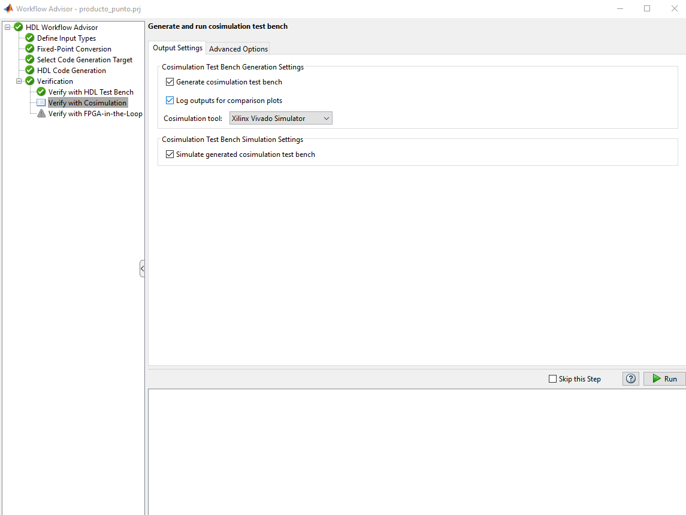

Al finalizar aparecerá un gráfico como el siguiente:


El gráfico muestra error 0 para los datos testeados, y es importante remarcar lo siguiente: **solo aplica a los datos testeados**. Si se ingresan valores fuera del rango probado, se pueden obtener salidas incorrectas. Por ejemplo, si se probó un sistema con entradas entre -100 y 100 con 4 decimales de precisión, valores mayores podrían producir salidas sin sentido.

Una vez verificada esta etapa, se pasa a **Verify with FPGA-in-the-Loop (FIL)**. Se activan todas las casillas, se configura la conexión de la FPGA a usar y se presiona **Run**. Esta etapa es lenta, pues se sintetiza, implementa, genera el bitstream y se programa la FPGA para comparar sus salidas con el testbench.

En esta etapa, Vivado puede fallar si el `path` supera los 260 caracteres. Si ocurre, se recomienda mover el proyecto más cerca de la raíz del disco.


Al finalizar, se genera el siguiente gráfico:

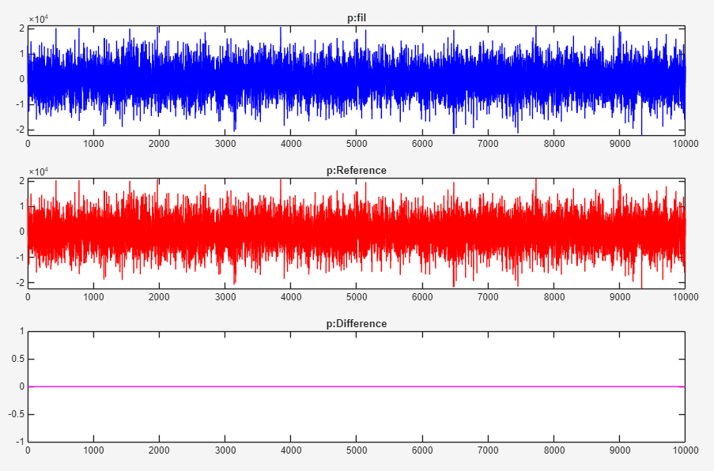

Al igual que en cosimulación, no se observa error para los datos usados como muestra. Con esto el proceso finaliza y se obtiene confianza en que, dentro del rango de prueba, el sistema HDL funciona correctamente. Sin embargo, no debe olvidarse que en fixed-point hubo una pérdida de precisión del orden de 1e-2. Esta pérdida no aparece en esta etapa final porque la comparación se realiza con la versión fixed-point y no con el test original.

Con el flujo completado, se puede ir a `codegen/<nombre_proyecto>/hdlsrc` y utilizar los archivos `.v` (o el lenguaje seleccionado). También es posible continuar en Simulink con **FIL Wizard** para probar nuevos valores de forma más sencilla y visual; la configuración detallada se explica en la [guía FIL](../HDL_Verifier/FIL/README.md).

## Ejemplo MPC (caso complejo)

El ejemplo anterior ocurrió sin inconvenientes. A continuación se muestra un caso más complejo basado en MPC, donde los cálculos matriciales y la cantidad de iteraciones son elevados. Esto hace que, si no se optimiza, el uso de recursos sea excesivo. Desde este punto no se detalla el Workflow Advisor, ya que se explicó en el ejemplo anterior.

Para este MPC se tienen dos funciones y un test:

<details>
<summary>Ver código original del caso MPC</summary>

```matlab
%% QP SOLVER - ADMM
% ===============================================================================
% Alfonso Cortes Neira - Universidad Técnica Federico Santa María
% 16-02-2023
% Based on the work by Juan David Escárate
% ===============================================================================

function [t] = fx_qp_admm(q, g, iters)
% fx_qp_admm - Solución de un problema de optimización cuadrática con ADMM
N_SYS = 2;
M_SYS = 1;
N_HOR = 4;

N_QP = N_HOR * M_SYS;
M_QP = 2 * N_HOR * (N_SYS + M_SYS);

G = [1 0 0 0;0 1 0 0;0 0 1 0;0 0 0 1;-1 0 0 0;0 -1 0 0;0 0 -1 0;0 0 0 -1;0.0385394841 0 0 0;1.93594096e-05 0 0 0;0.0374783464 0.0385394841 0 0;5.73658581e-05 1.93594096e-05 0 0;0.0364464223 0.0374783464 0.0385394841 0;9.43258419e-05 5.73658581e-05 1.93594096e-05 0;0.0354429111 0.0364464223 0.0374783464 0.0385394841;0.000130268178 9.43258419e-05 5.73658581e-05 1.93594096e-05;-0.0385394841 0 0 0;-1.93594096e-05 0 0 0;-0.0374783464 -0.0385394841 0 0;-5.73658581e-05 -1.93594096e-05 0 0;-0.0364464223 -0.0374783464 -0.0385394841 0;-9.43258419e-05 -5.73658581e-05 -1.93594096e-05 0;-0.0354429111 -0.0364464223 -0.0374783464 -0.0385394841;-0.000130268178 -9.43258419e-05 -5.73658581e-05 -1.93594096e-05];

R_inv = [2.47927713 -0.0101672383 -0.00845972542 -0.00676105311;-0.0101672392 2.48085499 -0.00855126418 -0.00680351257;-0.00845972635 -0.00855126418 2.48251104 -0.00685224542;-0.00676105265 -0.00680351257 -0.00685224542 2.48425579];

P = [-0.100709476 0 0 0 0.100709476 0 0 0 -0.00388129125 -1.94967606e-06 -0.00377442455 -5.77728542e-06 -0.00367050013 -9.49950572e-06 -0.00356943696 -1.31192401e-05 0.00388129125 1.94967606e-06 0.00377442455 5.77728542e-06 0.00367050013 9.49950572e-06 0.00356943696 1.31192401e-05;0 -0.100709476 0 0 0 0.100709476 0 0 0 0 -0.00388129125 -1.94967606e-06 -0.00377442455 -5.77728542e-06 -0.00367050013 -9.49950572e-06 0 0 0.00388129125 1.94967606e-06 0.00377442455 5.77728542e-06 0.00367050013 9.49950572e-06;0 0 -0.100709476 0 0 0 0.100709476 0 0 0 0 0 -0.00388129125 -1.94967606e-06 -0.00377442455 -5.77728542e-06 0 0 0 0 0.00388129125 1.94967606e-06 0.00377442455 5.77728542e-06;0 0 0 -0.100709476 0 0 0 0.100709476 0 0 0 0 0 0 -0.00388129125 -1.94967606e-06 0 0 0 0 0 0 0.00388129125 1.94967606e-06];

    persistent tk zk uk

    if isempty(tk)
        tk = zeros(N_QP, 1, 'single');
        zk = zeros(M_QP, 1, 'single');
        uk = zeros(M_QP, 1, 'single');
    end
    
    % Iteraciones de ADMM
    for k = 1:iters
        v_x = zk - g + uk;
        tk = R_inv * (P * v_x - q);  % Actualizar tk
        zk = max(0, -G * tk - uk + g);       % Actualizar zk
        uk = uk + (G * tk + zk - g);
    end
    t=tk;
end

function uk = mpc(xk, rk, IT_ADMM)

N_HOR = 4;      % Tamaño del horizonte de predicción
umin = -3;
umax = 3;
xmin = [-5; -2];
xmax = [5; 2];

%% Formulación Densa
N_SYS = 2;
M_SYS = 1;

D = [0.972466171 0;0.000986168976 1;0.945690453 0;0.00194518501 1;0.919651926 0;0.0028777956 1;0.894330382 0;0.00378472777 1];
F = [0.0214235317 0.0213781651 0.0213316325 0.0212839693;0.64161247 0.638990045 0.636372685 0.633760333];
T_inv = [-0.502326608 1000 0;0 0 1;25.5885372 714.431946 0];

ref = [zeros(N_SYS,1,'single'); rk];
inf = T_inv * ref;
xinf = inf(1:N_SYS);
uinf = inf(N_SYS+1 : N_SYS+M_SYS);
q = ((xk - xinf)' * F)';
c = repmat(umax - uinf, N_HOR, 1);
d = repmat(umin - uinf, N_HOR, 1);
e = repmat(xmax - xinf, N_HOR, 1);
f = repmat(xmin - xinf, N_HOR, 1);
g = [c; -d; e - D * xk; D * xk - f];

t_ADMM = fx_qp_admm(q, g, IT_ADMM);
uk = t_ADMM(1:M_SYS) + uinf;

end
```

Test utilizado:

```matlab
%% MPC for DC-DC motor, dense formulation
% ===============================================================================
% Francisca Donoso Bastias - Universidad Técnica Federico Santa María
% 22-12-2025
% Based on the work by Andrew Morrison and Alfonso Cortes
% https://github.com/morrisort/embeddedMPC/
% ===============================================================================
clc; clear;

%% Parámetros del sistema

format('longE')

N_HOR = 4;      % Tamaño del horizonte de predicción

% Arreglo de tiempo
Ts = 0.001;         % Periodo de muestreo en segundos
tsimu = 3;          % Tiempo de simulación en segundos
k = 0:Ts:tsimu-Ts;

% Datos del servomotor en tiempo discreto
kappa = 39.08/27.92;
tau = 1/27.92;
A = [exp(-Ts/tau), 0; tau*(1-exp(-Ts/tau)), 1];
B = [kappa*(1-exp(-Ts/tau)); Ts*kappa + tau*kappa*(exp(-Ts/tau) - 1)];
C = [0, 1];
x0 = single([3.0; -1.0]);    % Velocidad y posición angular inicial

% Restricciones del sistema
%umin = single(-3);
%umax = single(3);
%xmin = single([-5; -2]);
%xmax = single([5; 2]);

Gamma = 0.1;
Omega = C' * C;
[Linf, OmegaN, ~] = dlqr(A, B, Omega, Gamma);

% Referencia deseada del sistema
rk = zeros(1, length(k));
rk(1, 1:1500) = rk(1, 1:1500) + 1;

IT_ADMM = 10;

%% Formulación Densa

N_SYS = 2;
M_SYS = 1;

N_QP = N_HOR * M_SYS;
M_QP = 2 * N_HOR * (N_SYS + M_SYS);
xk = zeros(N_SYS, length(k), 'single');
uk = zeros(M_SYS, length(k), 'single');
xk(:, 1) = x0;

%% Iteración MPC

for i = 1:length(k)
    uk_ = mpc(xk(:, i),rk(:,i), IT_ADMM);
 
    uk(:, i) = uk_;
    xk(:, i + 1) = A * xk(:, i) + B * uk(:, i);
end

%% Graficar resultados

figure
plot(rk(1, :))
hold on
plot(xk(1, :))
plot(xk(2, :))
plot(uk(1, :))
grid on
legend('Referencia r', 'Estado x0', 'Estado x1', 'Entrada u')
```

</details>

Este diseño no contiene funciones incompatibles con HDL Coder, pero su forma de descripción dificulta la optimización y puede generar un HDL no óptimo, con errores o excesivo uso de recursos.

Se replica el procedimiento del Workflow Advisor con la misma configuración del ejemplo anterior, sin usar optimización de **Stream loops**. Una vez generado el HDL, se observan los siguientes recursos:

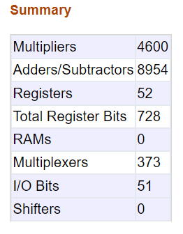

La utilización es muy alta. Aunque la cosimulación puede completarse sin errores, al intentar llevarlo a FPGA la herramienta intenta ajustar toda la lógica y termina fallando por tamaño. Por ello es importante estimar el uso de recursos antes de continuar. En este caso, ~4000 multiplicadores es demasiado para la FPGA utilizada.

Se vuelve a la configuración de generación HDL y se activa **Stream loops**:

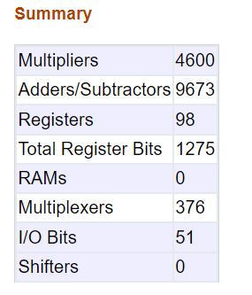

Se observa incluso mayor uso de recursos. Esto indica que la forma de escribir el código no está favoreciendo la optimización automática. Por ello se modificará el archivo `.m` sin cambiar su funcionalidad, comenzando por `fx_qp_admm`.

Se detectan los siguientes problemas:
- Se usa `persistent`, lo que dificulta el uso de recursos compartidos.
- Se usa una variable como cantidad de iteraciones.
- Se usan muchas multiplicaciones en operaciones matriciales; si la herramienta no logra compartir recursos, debe hacerse manualmente.
- Se tienen bucles `for` anidados, lo que también dificulta aplicar `stream`. Según la documentación de MathWorks, `HDL Coder` no puede aplicar `coder.hdl.loopspec('stream')` a un bucle anidado dentro de otro bucle, y además existen restricciones adicionales cuando hay varios bucles anidados al mismo nivel. Referencias: [Optimize MATLAB Loops](https://www.mathworks.com/help/hdlcoder/ug/loop-optimization-1.html) y [Why does Loop Streaming not work for my nested loop when generating HDL Code?](https://www.mathworks.com/matlabcentral/answers/422988-why-does-loop-streaming-not-work-for-my-nested-loop-when-generating-hdl-code).

Se propone la siguiente versión de `fx_qp_admm`:

<details>
<summary>Ver versión reescrita de <code>fx_qp_admm</code></summary>

```matlab
%% QP SOLVER - ADMM
% ===============================================================================
% Alfonso Cortes Neira - Universidad Técnica Federico Santa María
% 16-02-2023
% Based on the work by Juan David Escárate
% ===============================================================================
function [t] = fx_qp_admm(q, g, iters)
% fx_qp_admm - Solución de un problema de optimización cuadrática con ADMM

    N_SYS = 2;
    M_SYS = 1;
    N_HOR = 4;

    N_QP = N_HOR * M_SYS;                 % 4
    M_QP = 2 * N_HOR * (N_SYS + M_SYS);   % 24
    G = single([ 1 0 0 0;
                 0 1 0 0;
                 0 0 1 0;
                 0 0 0 1;
                -1 0 0 0;
                 0 -1 0 0;
                 0 0 -1 0;
                 0 0 0 -1;
                 0.0385394841 0 0 0;
                 1.93594096e-05 0 0 0;
                 0.0374783464 0.0385394841 0 0;
                 5.73658581e-05 1.93594096e-05 0 0;
                 0.0364464223 0.0374783464 0.0385394841 0;
                 9.43258419e-05 5.73658581e-05 1.93594096e-05 0;
                 0.0354429111 0.0364464223 0.0374783464 0.0385394841;
                 0.000130268178 9.43258419e-05 5.73658581e-05 1.93594096e-05;
                -0.0385394841 0 0 0;
                -1.93594096e-05 0 0 0;
                -0.0374783464 -0.0385394841 0 0;
                -5.73658581e-05 -1.93594096e-05 0 0;
                -0.0364464223 -0.0374783464 -0.0385394841 0;
                -9.43258419e-05 -5.73658581e-05 -1.93594096e-05 0;
                -0.0354429111 -0.0364464223 -0.0374783464 -0.0385394841;
                -0.000130268178 -9.43258419e-05 -5.73658581e-05 -1.93594096e-05 ]);

    R_inv = single([ 2.47927713   -0.0101672383 -0.00845972542 -0.00676105311;
                    -0.0101672392  2.48085499   -0.00855126418 -0.00680351257;
                    -0.00845972635 -0.00855126418 2.48251104   -0.00685224542;
                    -0.00676105265 -0.00680351257 -0.00685224542 2.48425579 ]);

    P = single([ -0.100709476 0 0 0 0.100709476 0 0 0 -0.00388129125 -1.94967606e-06 -0.00377442455 -5.77728542e-06 -0.00367050013 -9.49950572e-06 -0.00356943696 -1.31192401e-05 0.00388129125 1.94967606e-06 0.00377442455 5.77728542e-06 0.00367050013 9.49950572e-06 0.00356943696 1.31192401e-05;
                  0 -0.100709476 0 0 0 0.100709476 0 0 0 0 -0.00388129125 -1.94967606e-06 -0.00377442455 -5.77728542e-06 -0.00367050013 -9.49950572e-06 0 0 0.00388129125 1.94967606e-06 0.00377442455 5.77728542e-06 0.00367050013 9.49950572e-06;
                  0 0 -0.100709476 0 0 0 0.100709476 0 0 0 0 0 -0.00388129125 -1.94967606e-06 -0.00377442455 -5.77728542e-06 0 0 0 0 0.00388129125 1.94967606e-06 0.00377442455 5.77728542e-06;
                  0 0 0 -0.100709476 0 0 0 0.100709476 0 0 0 0 0 0 -0.00388129125 -1.94967606e-06 0 0 0 0 0 0 0.00388129125 1.94967606e-06 ]);

    q = single(q);   % 4x1
    g = single(g);   % 24x1

    % se declaran solo como matrices de 0 las variables que conservar un valor para la iteracion siguiente
    % sin el uso de persistent

    tk = zeros(N_QP, 1, 'single');  % 4x1
    zk = zeros(M_QP, 1, 'single');  % 24x1
    uk = zeros(M_QP, 1, 'single');  % 24x1

    v_x = zeros(M_QP, 1, 'single'); % 24x1
    y   = zeros(N_QP, 1, 'single'); % 4x1  (P*v_x - q)
    w   = zeros(M_QP, 1, 'single'); % 24x1 (G*tk)

    % Matlab no recomienda que una iteracion del for sea una entrada o una variable al
    % convertir a HDL, la cantidad de recursos aumenta y la precicion
    % interna disminuye, por ello se toma un valor maximo que puede tomar
    % las iteraciones, para que se genere un hardware mas preciso

    MAX_ITERS = coder.const(100);  % limite fijo para el hardware

    % Saturar iters al rango [0, MAX_ITERS]
    if iters < 0
        iters_eff = int32(0);
    elseif iters > MAX_ITERS
        iters_eff = int32(MAX_ITERS);
    else
        iters_eff = int32(iters);
    end

    % Bucle exterior con limite fijo y streaming
    coder.hdl.loopspec('stream', MAX_ITERS);
    
    for k = 1:MAX_ITERS
        % Solo hacemos el cuerpo del bucle si no hemos superado iters_eff
        if k <= iters_eff

            % ------------------------------------------------------------
            % v_x = zk - g + uk   (24 iteraciones)
            coder.hdl.loopspec('stream',24);
            for i = 1:24
                v_x(i) = zk(i) - g(i) + uk(i);
            end

            % ------------------------------------------------------------
            % y = P*v_x - q
            % P*v_x: (4x24)*(24x1) -> 4x1
            coder.hdl.loopspec('stream',4);
            for r = 1:4
                acc = single(0);
                coder.hdl.loopspec('stream',24);
                for c = 1:24
                    acc = acc + P(r,c) * v_x(c);
                end
                y(r) = acc - q(r);
            end

            % ------------------------------------------------------------
            % tk = R_inv * y   (4x4)*(4x1) -> 4x1
            coder.hdl.loopspec('stream',4);
            for r = 1:4
                acc = single(0);
                coder.hdl.loopspec('stream',4);
                for c = 1:4
                    acc = acc + R_inv(r,c) * y(c);
                end
                tk(r) = acc;
            end

            % ------------------------------------------------------------
            % w = G*tk   (24x4)*(4x1) -> 24x1
            coder.hdl.loopspec('stream',24);
            for r = 1:24
                acc = single(0);
                coder.hdl.loopspec('stream',4);
                for c = 1:4
                    acc = acc + G(r,c) * tk(c);
                end
                w(r) = acc;
            end

            % ------------------------------------------------------------
            % zk = max(0, -w - uk + g)  (24 iteraciones)
            coder.hdl.loopspec('stream',24);
            for i = 1:24
                ztmp = -w(i) - uk(i) + g(i);
                if ztmp < 0
                    zk(i) = single(0);
                else
                    zk(i) = ztmp;
                end
            end

            % ------------------------------------------------------------
            % uk = uk + (w + zk - g)    (24 iteraciones)
            coder.hdl.loopspec('stream',24);
            for i = 1:24
                uk(i) = uk(i) + (w(i) + zk(i) - g(i));
            end

        end % if k <= iters_eff

    end % for k = 1:MAX_ITERS

    t = tk;
end
```

</details>

Para reducir el uso de recursos sin alterar la función matemática del algoritmo, la idea fue transformar una descripción muy compacta, pero difícil de optimizar, en una versión más explícita para HDL Coder. El cambio principal no está en el resultado del cálculo, sino en cómo se expresa el algoritmo para facilitar el uso de recursos compartidos.

Se realizaron los siguientes cambios:

En el `for` de iteraciones ahora se usa un maximo fijo:

<details>
<summary>Ver fragmentos clave de la reescritura</summary>

```matlab
MAX_ITERS = coder.const(100);  % limite fijo para el hardware

% Saturar iters al rango [0, MAX_ITERS]
if iters < 0
    iters_eff = int32(0);
elseif iters > MAX_ITERS
    iters_eff = int32(MAX_ITERS);
else
    iters_eff = int32(iters);
end

% Bucle exterior con limite fijo y streaming
coder.hdl.loopspec('stream', MAX_ITERS);

for k = 1:MAX_ITERS
    % Solo hacemos el cuerpo del bucle si no hemos superado iters_eff
    if k <= iters_eff
```

Con esto, `iters` deja de ser un valor completamente variable para el hardware. El bucle se limita a `MAX_ITERS` y se evita que el compilador tenga que inferir una arquitectura demasiado flexible durante la ejecución. Además, se usa la directiva `coder.hdl.loopspec('stream', N)`, lo que permite compartir recursos a cambio de ejecutar el bloque en `N` ciclos.

También se descompusieron operaciones matriciales en bucles explícitos para facilitar el streaming. Por ejemplo, el cálculo de `v_x`:

```matlab
% v_x = zk - g + uk   (24 iteraciones)
coder.hdl.loopspec('stream',24);
for i = 1:24
    v_x(i) = zk(i) - g(i) + uk(i);
end
```

</details>

Con estas modificaciones, al generar HDL se obtiene el siguiente mensaje:

```
### The DUT requires an initial pipeline setup latency. Each output port experiences these additional delays.
### Output port 1: 1 cycles.
 ### MESSAGE: The design requires 100 times faster clock with respect to the base rate = 1.
```

Esto indica que ahora se requieren hasta 100 ciclos internos por cada entrada, y que la salida queda desfasada un ciclo respecto del tiempo de muestreo de entrada.

Resultados de recursos:

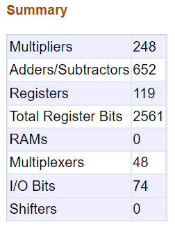

Se observa una reducción importante de recursos, suficiente para que el diseño quepa en la FPGA. Aun así, todavía existe margen de optimización, ya que la función `mpc` también contiene cálculos matriciales que podrían reescribirse para compartir recursos.

## Verificacion de timing (post-FIL)

Para saber si el timing se cumple, una vez finalizado el flujo FIL se debe revisar el reporte en:

`mpc_fixpt_fil/fpgaproj/mpc_fixpt_fil.runs/impl_1/mpc_fixp_fil_timing_summary_routed.rpt`

En ese archivo se encuentra el resumen de timing para el reloj elegido. Un extracto tipico es:

```
------------------------------------------------------------------------------------------------
| Design Timing Summary
| ---------------------
------------------------------------------------------------------------------------------------

    WNS(ns)      TNS(ns)  TNS Failing Endpoints  TNS Total Endpoints      WHS(ns)      THS(ns)  THS Failing Endpoints  THS Total Endpoints     WPWS(ns)     TPWS(ns)  TPWS Failing Endpoints  TPWS Total Endpoints
    -------      -------  ---------------------  -------------------      -------      -------  ---------------------  -------------------     --------     --------  ----------------------  --------------------
    -45.561   -15428.046                    445                 3408        0.044        0.000                      0                 3408        3.000        0.000                       0                  1722

------------------------------------------------------------------------------------------------
| Intra Clock Table
| -----------------
------------------------------------------------------------------------------------------------

Clock                     WNS(ns)      TNS(ns)  TNS Failing Endpoints  TNS Total Endpoints      WHS(ns)      THS(ns)  THS Failing Endpoints  THS Total Endpoints     WPWS(ns)     TPWS(ns)  TPWS Failing Endpoints  TPWS Total Endpoints
-----                     -------      -------  ---------------------  -------------------      -------      -------  ---------------------  -------------------     --------     --------  ----------------------  --------------------
TCK                         5.516        0.000                      0                  943        0.079        0.000                      0                  943        6.596        0.000                       0                   508
sysclk                                                                                                                                                                  3.000        0.000                       0                     1
  clk_out1_clk_wiz_0      -45.561   -15428.046                    445                 2465        0.044        0.000                      0                 2465       18.750        0.000                       0                  1210
  clkfbout_clk_wiz_0                                                                                                                                                    7.845        0.000                       0                     3

Timing constraints are not met.

Clock                 Waveform(ns)       Period(ns)      Frequency(MHz)
-----                 ------------       ----------      --------------
TCK                   {0.000 7.576}      15.152          65.998
sysclk                {0.000 5.000}      10.000          100.000
  clk_out1_clk_wiz_0  {0.000 20.000}     40.000          25.000
  clkfbout_clk_wiz_0  {0.000 5.000}      10.000          100.000
```

En este ejemplo, `clk_out1_clk_wiz_0` es el reloj interno del diseño y `TCK` es el reloj del wrapper que comunica la FPGA con MATLAB/Simulink. El valor `WNS = -45.561` indica que, para el reloj interno de 40 ns (25 MHz), el diseño aún necesita al menos 45.561 ns adicionales para cumplir la restricción. En otras palabras, ese camino crítico no alcanza a cerrar timing.

Es importante considerar que cada implementación puede cambiar el timing según la optimización que realice la herramienta durante síntesis, mapeo y ruteo. Por eso, para analizar el timing con mayor precisión, se recomienda implementar el HDL generado directamente en Vivado, o en la herramienta del fabricante correspondiente. Aun así, revisar este reporte dentro del flujo FIL entrega una primera idea de cuán lejos o cerca está el diseño del objetivo, y si es necesario ajustar el código `.m` o la configuración de HDL Coder.

## Efecto del output delay en FIL

Para evaluar si el output delay afecta el desempeño, conviene modelarlo explícitamente en Simulink. El siguiente diagrama representa el PID con anti-windup del ejemplo `PIDaw`, con un output delay de 1:

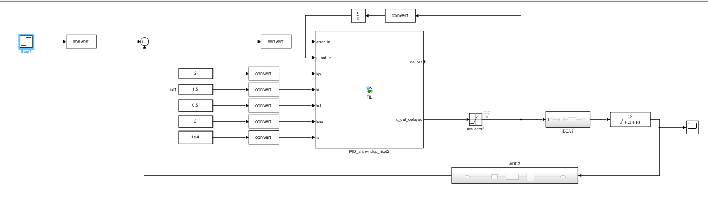

_(TODO: por subir imagen al repositorio)._

Si se quiere visualizar cómo se vería con un output delay de 5, se puede representar así:

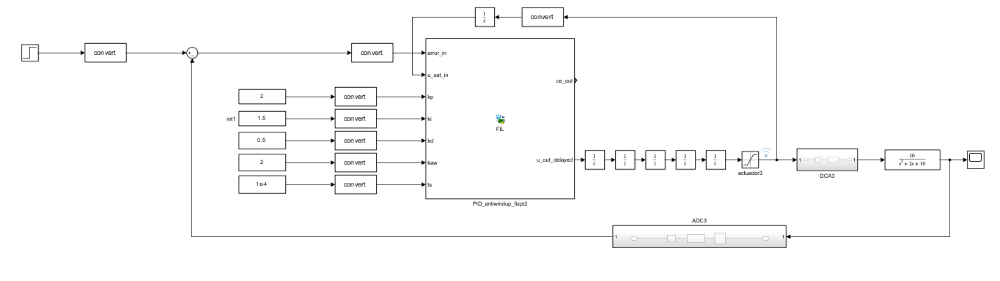

_(TODO: por subir imagen al repositorio)._

Cada bloque **Unit Delay** usa el mismo sample time que la entrada al bloque FIL, que en este caso es **1 ms**. Por lo tanto, un output delay de 5 implica **5 ciclos de latencia** desde la salida del controlador hasta la planta.

Es clave separar **throughput** y **latencia**:

- El throughput se mantiene en **1 ms**: la planta recibe una nueva muestra cada 1 ms.
- La latencia aumenta a **5 ms**: un cambio en la salida del controlador se refleja en la entrada de la planta 5 ms después.

Si el requisito del diseño es que un cambio en la salida se vea reflejado en la entrada de la planta en **1 ms**, entonces un output delay de 5 **no cumple** ese requisito, porque la planta recién ve el efecto a los **5 ms**.

## Limitaciones y criterios de uso

HDL Coder es una herramienta muy efectiva para acelerar la transición desde modelos de alto nivel a implementaciones HDL verificables. Sin embargo, en diseños complejos no garantiza por sí sola el resultado óptimo en recursos o timing. Cuando el modelo no está escrito con criterios de sintetizabilidad, suele ser necesario refactorizar funciones, controlar iteraciones, ajustar tipos y redefinir arquitectura.

En la práctica, la herramienta funciona mejor como acelerador de iteración y validación temprana: permite llegar rápido a una implementación funcional, detectar cuellos de botella y orientar decisiones de diseño. Para usuarios con menor experiencia en RTL, este enfoque reduce la barrera de entrada y permite aprender de forma progresiva, siempre complementando con revisión de reportes y criterio de ingeniería digital.
