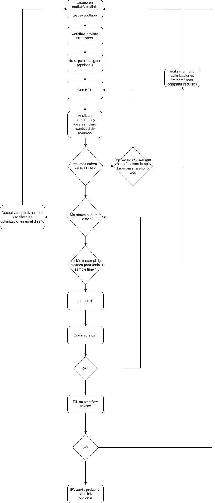

# Introducción al uso de HDL Coder en MATLAB

HDL Coder de MATLAB se utiliza como una herramienta clave para la **implementación de algoritmos en hardware digital**, permitiendo la generación automática de código HDL (VHDL o Verilog) a partir de modelos desarrollados y verificados en MATLAB o Simulink. Su objetivo principal es reducir la brecha entre el diseño algorítmico de alto nivel y su realización eficiente en FPGA o ASIC.

El uso de HDL Coder aporta múltiples ventajas en entornos de diseño profesional:

- **Reducción del tiempo de desarrollo**: al automatizar la generación de código HDL, se disminuye significativamente el esfuerzo requerido frente a la codificación manual en RTL.
- **Mayor confiabilidad del diseño**: el HDL se genera a partir de modelos previamente simulados y validados, lo que reduce errores de interpretación del algoritmo y mejora la consistencia entre especificación e implementación.
- **Facilidad de verificación y validación**: permite comparar los resultados del modelo original con el comportamiento del hardware generado, favoreciendo procesos de verificación más estructurados.
- **Control de la arquitectura hardware**: ofrece mecanismos para definir latencias, pipeline, paralelismo y utilización de recursos, aspectos críticos en diseños digitales de alto desempeño.
- **Soporte para aritmética de punto fijo**: facilita la transición desde modelos en punto flotante hacia implementaciones en punto fijo, optimizadas para síntesis en hardware.
- **Integración con flujos industriales**: el código generado puede integrarse en proyectos existentes y es compatible con herramientas estándar de síntesis y verificación.

## Alcance del documento

El presente documento tiene como objetivo **facilitar el uso de HDL Coder** a usuarios que comienzan a trabajar con esta herramienta, proporcionando una guía práctica basada en **consejos útiles y buenas prácticas**. Su enfoque está orientado a ayudar al lector a comprender los aspectos fundamentales del flujo de trabajo, evitar errores comunes en las primeras etapas y adoptar criterios de diseño que favorezcan una implementación eficiente y verificable en hardware.

## Alcance del documento

El presente documento tiene como objetivo **facilitar el uso de HDL Coder** a usuarios que comienzan a trabajar con esta herramienta, proporcionando una guía práctica basada en **consejos útiles y buenas prácticas**. Su enfoque está orientado a ayudar al lector a comprender los aspectos fundamentales del flujo de trabajo, evitar errores comunes en las primeras etapas y adoptar criterios de diseño que favorezcan una implementación eficiente y verificable en hardware.

Este material no pretende reemplazar la documentación oficial de MathWorks, sino servir como un **complemento introductorio** orientado a la experiencia práctica. Para una descripción completa y detallada de la herramienta, se recomienda consultar la documentación oficial de HDL Coder disponible en  
https://www.mathworks.com/help/hdlcoder/index.html  
así como la guía de inicio  
https://www.mathworks.com/help/hdlcoder/getting-started-with-hdl-coder.html,  
donde se presentan los conceptos fundamentales, ejemplos y flujos de trabajo recomendados por el fabricante.

## Estructura y flujo de trabajo

A continuación, se presenta un **diagrama de flujo** que indica la **secuencia del uso de HDL Coder con workflow advisor** dentro del proceso de diseño. Este diagrama resume las principales etapas del flujo de trabajo, desde el desarrollo y validación del modelo hasta la generación de código HDL. 

En las secciones posteriores del documento, **cada uno de los puntos del diagrama será explicado en detalle**, justificando su propósito dentro del flujo de diseño y describiendo las razones por las cuales se recomienda seguir dicha secuencia para obtener implementaciones más eficientes, verificables y mantenibles.




Tal como se muestra en el diagrama, es necesario contar inicialmente con un **diseño en MATLAB o Simulink acompañado de un test exhaustivo del sistema**, con el fin de verificar su correcto funcionamiento antes de avanzar hacia etapas posteriores del flujo de diseño en hardware.

Para comenzar, se realizará un ejemplo sencillo en MATLAB correspondiente al **cálculo del producto punto entre dos vectores** el cua lse encuentra en examples/Producto_punto, este ejemplo sigue el flujo sin errores, luego se procedera con un flujo con errores para explicar buenas practicas. 
Este ejemplo se escribe de forma simple y clara, lo cual facilita su posterior análisis y adaptación al flujo de HDL Coder:

```matlab
function p = producto_punto(Vector_a, Vector_b)
% PRODUCTO_PUNTO_VECTORES Calcula el producto punto entre dos vectores

    p = Vector_a.' * Vector_b;

end
```
Una vez definido el algoritmo, es fundamental testearlo con una gran variedad de valores de entrada. Esto es especialmente importante cuando se planea utilizar herramientas como Fixed-Point Designer, ya que dicha herramienta toma como referencia los valores máximos y mínimos observados durante la simulación para determinar los rangos y la cantidad de recursos necesarios en la implementación hardware.

Si el hardware generado es posteriormente utilizado con valores que provoquen acumulaciones mayores o magnitudes superiores a las consideradas durante el test inicial —ya sea en las entradas o en variables internas— pueden aparecer errores por desbordamiento o pérdida de información debido a saturación. Por este motivo, un test amplio y representativo resulta crítico.

A continuación, se presenta un ejemplo de test que genera múltiples casos aleatorios:
```
% test_producto_punto_vectores.m
% Test: 1000 casos aleatorios para producto_punto_vectores

rng(0);                % Semilla para reproducibilidad (opcional)
N = 1000;              % Cantidad de ejemplos

% Golden reference (prealocar)
golden.Vector_a = zeros(3, N);
golden.Vector_b = zeros(3, N);
golden.p        = zeros(1, N);

for k = 1:N
    % Vectores 3x1 con valores uniformes entre 0 y 100
    Vector_a = 100 * rand(3,1);
    Vector_b = 100 * rand(3,1);

    p = producto_punto(Vector_a, Vector_b);

    % Guardar entradas y salida
    golden.Vector_a(:, k) = Vector_a;
    golden.Vector_b(:, k) = Vector_b;
    golden.p(k)           = p;
end

% Guardar a archivo .mat
save('golden_reference_producto_punto.mat', 'golden');
```
Tal como se observa en el código, además de realizar el test del algoritmo, se recomienda almacenar los valores de entrada y salida. De esta manera, si posteriormente se desea probar la implementación en Simulink bajo las mismas condiciones, se dispone de una referencia guardada en un archivo .mat, que puede utilizarse directamente mediante el bloque From Workspace. Esto facilita la validación cruzada entre MATLAB, Simulink y el HDL generado.

## Workflow Advisor: configuración y generación de HDL

A continuación se describe el flujo práctico dentro de HDL Coder una vez que ya se dispone del diseño en MATLAB y su testbench correspondiente.

### Apertura del Workflow Advisor

El Workflow Advisor puede abrirse desde el icono correspondiente:


También es posible iniciarlo desde la consola con el comando `hdlcoder`. En ambos casos se abre la siguiente ventana:


Se presiona **OK** y se abrirá la siguiente pantalla:


En **Add MATLAB function** se selecciona la función a convertir a HDL, y en **Add files** se agrega el test. Con ello se puede avanzar a **Workflow Advisor**. Antes de continuar se puede ejecutar **Autodefine types**, pero esta acción también se ejecuta dentro del flujo del Workflow, por lo que puede omitirse.

### Selección del flujo y tipos

En la siguiente ventana se decide si el flujo será hacia HLS (System C) o hacia HDL. En este caso se selecciona HDL. En **Fixed-Point Conversion** puede elegirse **Keep original types**, lo que mantiene los tipos de entrada originales. Sin embargo, si las entradas son `double` o `single`, la utilización de recursos se incrementa de forma significativa. Por ello se recomienda **Convert to fixed-point at build time**. Aun así, se mostrará la configuración para trabajar con punto flotante si fuese necesario.

En **Define Input Types** basta con ejecutar **Run** para que se ejecute el test y se determinen los rangos de entrada. Luego se pasa a **Fixed-Point Conversion**. Al ingresar, se espera hasta ver la siguiente ventana:


En (1) se selecciona si la herramienta recomendará el tamaño en bits o la precisión en decimales. Si se conoce la precisión deseada en decimales (como en este ejemplo), se elige esa opción y se ajusta la cantidad de decimales considerando la fórmula: TODO poner la formula para pasar de fraction a bits. Luego se presiona **Analyze** (2) para que la herramienta analice los máximos y mínimos y recomiende los tamaños.

Una vez ejecutado, se mostrará lo siguiente:


Aquí se observa el mínimo y máximo de la simulación, tanto de entradas como de salida. Al ser un ejemplo básico no hay variables internas, por lo que se pasa directamente a la salida. Se seleccionó un tipo fixed `(1,30,14)`, que indica un valor con signo de 30 bits, de los cuales 14 se usan para la fracción.

Luego se ejecuta **Validate Types** en la parte superior. Cuando termine, se recomienda ejecutar **Test Numerics** con las siguientes opciones:


Esto generará un gráfico comparando las salidas del test original y del test con el diseño convertido a fixed-point. Permite detectar si hubo pérdida de información al pasar a punto fijo.


En el gráfico se aprecia un error del orden de 1e-2. En fixed-point la pérdida de precisión fraccional es habitual, pero al aumentar los bits dedicados a la fracción se reduce el orden de magnitud del error. En casos sin fracciones, fixed-point puede llegar a error 0.

### Generación de código HDL

Se continúa a **HDL Code Generation**:


Se recomienda:

- Usar lenguaje Verilog (requiere menos configuración).
- Activar la generación de todos los reportes.

En **Clocks & Ports**:


Se debe activar **DUT base rate** (por defecto **Input data rate**) para poder realizar co-simulación.

En **Optimization** se recomienda, como primer intento, activar **Stream loops**, lo que permite compartir recursos en iteraciones (por ejemplo en bucles `for`). Para diseños complejos con bucles anidados o muchas iteraciones, la herramienta puede no optimizar correctamente y es necesario modificar el diseño `.m`. En ejemplos simples como este no es imprescindible.


Con esto se puede ejecutar **Run** y generar HDL. Esto produce una salida en la ventana con mensajes importantes, por ejemplo:

```
### Begin MATLAB to HDL Code Generation...
### Working on DUT: producto_punto_fixpt.
### Using TestBench: test.
### The DUT requires an initial pipeline setup latency. Each output port experiences these additional delays.
### Output port 1: 1 cycles.
 ### MESSAGE: The design requires 3 times faster clock with respect to the base rate = 1.
### Working on producto_punto_fixpt_tc as producto_punto_fixpt_tc.v.
### Begin Verilog Code Generation
### Working on producto_punto_fixptp3 as producto_punto_fixptp3.v.
### Working on producto_punto_fixpt as producto_punto_fixpt.v.
### Generating Resource Utilization Report resource_report.html.
 ### Generating Optimization report  
 ### To rerun codegen evaluate the following commands...

---------------------
cgi    = load('examples\Producto_punto\codegen\producto_punto\hdlsrc\codegen_info.mat');
cfg    = cgi.CodeGenInfo.codegenSettings;
fxpCfg = cgi.CodeGenInfo.fxpCfg;
codegen -float2fixed fxpCfg -config cfg -report
---------------------

 ### Generating HDL Conformance Report producto_punto_fixpt_hdl_conformance_report.html.
### HDL Conformance check complete with 0 errors, 1 warnings, and 1 messages.
 ### Code generation successful: View report
### Elapsed Time: '         15.2745' sec(s)
```

- `Output port 1: 1 cycles.` indica un desfase de 1 ciclo entre la entrada y la salida. Cuando entren los vectores A y B, la salida corresponde a A-1 y B-1.
- `MESSAGE: The design requires 3 times faster clock with respect to the base rate = 1.` indica que, al usar **Stream loops**, la herramienta compartió recursos y decidió usar un solo multiplicador, realizando el calculo en 3 ciclos en lugar de 1 con 3 multiplicadores.
- `Generating Resource Utilization Report resource_report.html.` es un reporte clave, pues permite evaluar si el uso de recursos es compatible con la FPGA objetivo.

Finalmente, el reporte de recursos puede verse, por ejemplo:


Aquí se observa que se utilizó un solo multiplicador, a pesar de que un producto punto de vectores 3x1 requiere 3 multiplicaciones. El conteo de sumadores, registros y multiplexores suele ser más difícil de analizar, ya que la conversión a HDL agrega lógica adicional para control y temporización.

### Generación sin Stream loops

A continuación se repite la generación de HDL, pero desactivando **Stream loops**:

```
### Begin MATLAB to HDL Code Generation...
### Working on DUT: producto_punto_fixpt.
### Using TestBench: test.
### Begin Verilog Code Generation
### Working on producto_punto_fixpt as producto_punto_fixpt.v.
### Generating Resource Utilization Report resource_report.html.
### Generating Optimization report  
### To rerun codegen evaluate the following commands...

---------------------
cgi    = load('C:\examples\Producto_punto\codegen\producto_punto\hdlsrc\codegen_info.mat');
cfg    = cgi.CodeGenInfo.codegenSettings;
fxpCfg = cgi.CodeGenInfo.fxpCfg;
codegen -float2fixed fxpCfg -config cfg -report
---------------------

### Generating HDL Conformance Report producto_punto_fixpt_hdl_conformance_report.html.
### HDL Conformance check complete with 0 errors, 0 warnings, and 0 messages.
 ### Code generation successful: View report
### Elapsed Time: '            5.1107' sec(s)
```

Ahora no aparecen los mensajes `Output port 1: 1 cycles` ni `MESSAGE: The design requires 3 times faster clock with respect to the base rate = 1`. Esto se debe a que, al no aplicar optimizaciones, se genera un HDL puramente combinacional sin requerir reloj. Usualmente esto consume más recursos pero es más rápido. En este ejemplo, la diferencia de utilización es pequeña porque el diseño es muy reducido.

Si en lugar de 3 iteraciones se tuvieran 10.000 o 100.000 (como es común en casos reales), sería necesario compartir recursos; de lo contrario el diseño no cabría en una FPGA.

### Generación en punto flotante

Se repite el proceso para punto flotante. En el **HDL Workflow Advisor**, en lugar de **Convert to fixed-point at build time** se selecciona **Keep original types**, lo que salta la etapa de fixed-point:


Luego se activan estas opciones de configuración para la generación de HDL, en el siguiente orden:

1) En **Optimization**, habilitar **Aggressive Dataflow Conversion**:


2) En **Advanced**, establecer **None** en **Check for presence of reals in the generated code**:


3) En **Floating Point**, activar **Use floating point** y seleccionar **NativeFloatingPoint**:


Ejecutando la generación de HDL en punto flotante con **Stream loops** activado, se obtiene la siguiente salida:

```
### Begin MATLAB to HDL Code Generation...
### Working on DUT: producto_punto.
### Using TestBench: test.
### The DUT requires an initial pipeline setup latency. Each output port experiences these additional delays.
### Output port 1: 26 cycles.
 ### MESSAGE: The design requires 3 times faster clock with respect to the base rate = 1.
### Working on producto_punto_tc as producto_punto_tc.v.
### Begin Verilog Code Generation
### Working on producto_punto/nfp_mul_double as nfp_mul_double.v.
### Working on producto_punto/nfp_add_double as nfp_add_double.v.
### Working on producto_punto as producto_punto.v.
### Generating Resource Utilization Report resource_report.html.
### Generating Optimization report  
### To rerun codegen evaluate the following commands...

---------------------
cgi    = load('C:\examples\Producto_punto\codegen\producto_punto\hdlsrc\codegen_info.mat');
inVals = cgi.CodeGenInfo.inVals;
cfg    = cgi.CodeGenInfo.codegenSettings;
codegen -config cfg -args inVals -report
---------------------

### Generating HDL Conformance Report producto_punto_hdl_conformance_report.html.
### HDL Conformance check complete with 0 errors, 0 warnings, and 1 messages.
 ### Code generation successful: View report
### Elapsed Time: '         14.5892' sec(s)
```

El mensaje `Output port 1: 26 cycles` indica que, si la frecuencia de entrada de datos es de 1 ms, la salida estará lista en 26 ms. Durante ese tiempo pueden seguir entrando nuevos datos, por lo que el throughput se mantiene pero la latencia de salida aumenta.

Si se revisan los recursos utilizados:


Se observa que, aunque se mantiene un solo multiplicador, el resto de recursos aumenta de forma considerable respecto de la versión fixed-point. Para este ejemplo sigue siendo totalmente factible por su tamaño reducido.

## Verificación del HDL y co-simulación

A continuación se prueba el HDL generado mediante un testbench, una co-simulación y, finalmente, una comparación con FPGA en lazo (FIL). Para este flujo se utiliza la versión con **Stream loops** y **fixed-point**.

Primero se ejecuta **Verify with HDL Test Bench**. Se activan las casillas correspondientes y se selecciona la herramienta de simulación. Si la herramienta no aparece, debe añadirse al `path`. Un ejemplo para Vivado 2023.1:

```
hdlsetuptoolpath('ToolName','Xilinx Vivado','ToolPath','C:\Xilinx\Vivado\2023.1\bin\vivado.bat');
```

Al ejecutar **Refresh List** debería aparecer la opción. Luego se presiona **Run**. Si surge un problema en esta etapa, suele indicar una mala formación del HDL. Las opciones de solución incluyen activar parámetros sugeridos por la consola en el reporte, o cambiar el lenguaje de salida si el error no es claro.


Luego se pasa a **Verify with Cosimulation**. En esta simulación se activan las casillas y es fundamental analizar los plots que comparan las salidas. Existe la posibilidad de que, si el código MATLAB es difícil de traducir a HDL (malas prácticas u optimizaciones inadecuadas), las salidas difieran de forma significativa: TODO linkear el ejemplo. Un fallo en esta etapa implica volver a modificar el `.m` para hacerlo compatible con HDL Coder. Esta etapa no soporta `double` ni `single` (floating point).


Al finalizar aparecerá un gráfico como el siguiente:


El gráfico muestra error 0 para los datos testeados, y es importante remarcar lo siguiente: **solo aplica a los datos testeados**. Si se ingresan valores fuera del rango probado, se pueden obtener salidas incorrectas. Por ejemplo, si se probó un sistema con entradas entre -100 y 100 con 4 decimales de precisión, valores mayores podrían producir salidas sin sentido.

Una vez verificada esta etapa, se pasa a **Verify with FPGA-in-the-Loop (FIL)**. Se activan todas las casillas, se configura la conexión de la FPGA a usar y se presiona **Run**. Esta etapa es lenta, pues se sintetiza, implementa, genera el bitstream y se programa la FPGA para comparar sus salidas con el testbench.

En esta etapa, Vivado puede fallar si el `path` supera los 260 caracteres. Si ocurre, se recomienda mover el proyecto más cerca de la raíz del disco.


Al finalizar, se genera el siguiente gráfico:


Al igual que en cosimulación, no se observa error para los datos usados como muestra. Con esto el proceso finaliza y se obtiene confianza en que, dentro del rango de prueba, el sistema HDL funciona correctamente. Sin embargo, no debe olvidarse que en fixed-point hubo una pérdida de precisión del orden de 1e-2. Esta pérdida no aparece en esta etapa final porque la comparación se realiza con la versión fixed-point y no con el test original.

Con el flujo completado, se puede ir a `codegen/nameproyect/hdlsrc` y utilizar los archivos `.v` (o el lenguaje seleccionado). También es posible continuar en Simulink con **FIL Wizard** para probar nuevos valores de forma más sencilla y visual: TODO linkear.

Para finalizar, se realizará una comparación entre la salida del test de MATLAB y la salida de la FPGA ya cargada con el bitstream del HDL. Esta etapa requiere tener configurada la conexión con la FPGA; una guía se explica en este documento: TODO adjuntar el link.
