# PID con Anti-Windup en Simulink, HDL Coder y FIL

En este ejemplo se ilustra el diseno e implementacion de un controlador PID con
anti-windup en MATLAB/Simulink y el flujo de conversion a HDL con HDL Coder. El
diseno del PID considera todos sus parametros como entradas editables desde
fuera. Luego, usando HDL Verifier, se busca probar en FPGA el diseno del PID con
anti-windup dentro de un lazo cerrado en Simulink para una planta generica,
analizando el comportamiento ante cambios de ajuste sin depender de software
adicional.

Ademas, se documenta la estructura discreta del PID, su implementacion en
Simulink y los pasos minimos para convertir el subsystem a HDL y validarlo en
un esquema FPGA-in-the-Loop.

## Requisitos

- MATLAB/Simulink R2025b Update 2 (`2025.2`)
- HDL Coder
- HDL Verifier
- Vivado `2023.1`

## Quick Start

1. Abrir el modelo `PID_antiwidup.slx` en MATLAB.
2. Verificar que el controlador use datos en punto fijo `fixdt(1,32,26)` en
   entradas y señales principales.
3. Ejecutar la simulacion del lazo cerrado en Simulink.
4. Generar HDL del subsystem del PID con HDL Coder.
5. Crear el bloque FIL con HDL Verifier y configurar la compilacion en Vivado
   `2023.1`.
6. Ejecutar la co-simulacion FPGA-in-the-Loop y comparar la respuesta con la
   simulacion base de Simulink.

En esta etapa se modela un PID con anti-windup en tiempo discreto. El error se
define como e[k] y la salida del controlador como u[k]. La estructura considera
parte proporcional, integral con anti-windup y derivativa.

## Parte proporcional

La parte proporcional se implementa en el bloque `Proporcional_gain`:

$$
P[k] = K_p \cdot e[k]
$$

Responde de forma inmediata al error actual y no tiene memoria.

## Parte integral con anti-windup

La parte integral se implementa en el bloque `I_component` con los terminos de
ganancia integral y anti-windup:

$$
I[k] = I[k-1] + (K_i e[k] + K_{aw} (u_{sat}[k] - u[k])) T_s
$$

El termino de anti-windup reduce la acumulacion cuando la salida esta saturada.

## Parte derivativa

La parte derivativa se implementa en el bloque `D_component`:

$$
D[k] = K_d T_s (e[k] - e[k-1])
$$

Aporta amortiguamiento y anticipa cambios rapidos del error.

## Suma final y saturacion

La salida del PID se obtiene como:

$$
u[k] = P[k] + I[k] + D[k]
$$

Luego se aplica la saturacion para obtener $u_{sat}[k]$ y se realimenta la
diferencia $u_{sat}[k] - u[k]$ al integrador.

Modelo PID con anti-windup en Simulink.

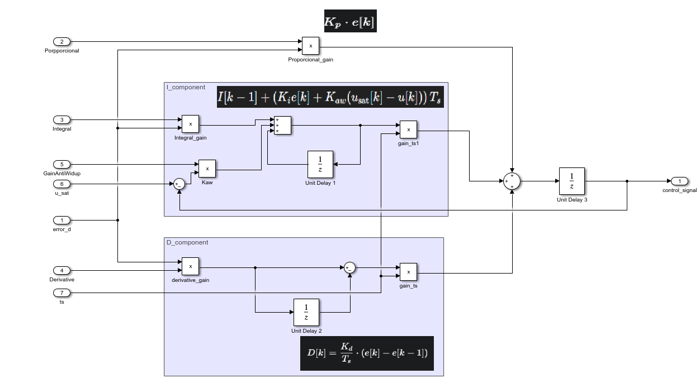

Para la implementacion en HDL, es necesario que todas las entradas y modulos
trabajen con tipos de datos enteros o de punto fijo (`int`, `fixdt` o
`logical`). En este caso se usara `fixdt(1,32,26)` para las entradas, y para
los sumadores y multiplicadores se utiliza `fixdt(1,36,26)`. Esto significa que
se usan 36 - 26 = 10 bits para la parte entera y 26 bits de precision para la
parte decimal, lo cual es adecuado porque el voltaje no suele tomar valores
altos y se requiere mas detalle fraccional.

Ademas, se habilita la opcion `Saturate on overflow` para que, si el resultado
supera el limite inferior o superior, quede limitado en ese valor y no ocurra
un desbordamiento que invierta el signo o produzca saltos no deseados.

Tambien es necesario que, para usar HDL Coder, todos los bloques sean
compatibles con el flujo de generacion. En particular, las sumas y
multiplicaciones deben operar con tipos de datos enteros o de punto fijo, como
`int`, `fixdt` o equivalentes, para evitar conversiones no soportadas.

Configuracion de tipos de datos y saturacion en sumadores.

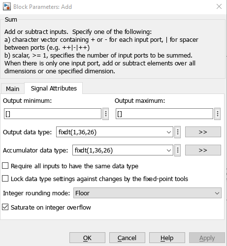

Configuracion de tipos de datos y saturacion en multiplicadores.

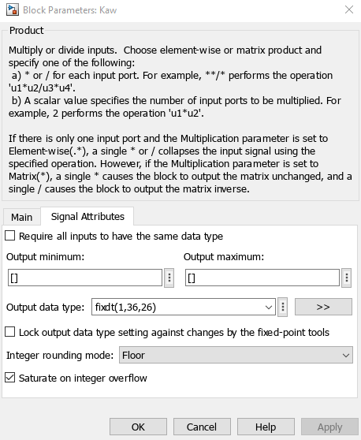

Configuracion de tipos de datos y saturacion en bloques aritmeticos.

Subsystem del PID en Simulink.

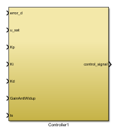

Teniendo el Subsystem del controlador PID pasamos a crearle un lazo cerrado
para las pruebas.

Lazo cerrado en Simulink con actuador y planta.

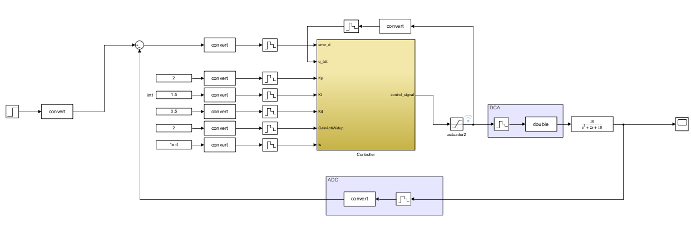

Para validar el controlador se disena un lazo cerrado simple donde el actuador
se modela con una saturacion de $\pm 10$ y la planta con la funcion de
transferencia:

$$
G(s) = \frac{10}{s^2 + 2s + 10}
$$

Consideraciones principales:

- El PID diseñado es discreto, por lo que las entradas deben discretizarse
  usando un `Zero-Order Hold` el cual debe ser el mismo que Ts en este caso
  1e-4.
- Las entradas se manejan con `fixdt(1,32,26)`, por lo que se usa un bloque
  `Data Type Conversion` antes del controlador dado que simulink trabaja
  nativamente con Double en punto flotante.
- Entre el sistema discretizado y la planta continua se usa un `Zero-Order
  Hold` y un `Data Type Conversion` a `double`; esto simula un DAC.
- En la retroalimentacion de la planta hacia el controlador se usa un
  `Zero-Order Hold` y una conversion de `double` a `fixdt(1,32,26)`; esto simula
  un ADC.
- Para la conexion de la salida del actuador con el controlador se usa un
  bloque `Conversion` y un `Zero-Order Hold`.

Para el controlador se usaron los parametros $K_p = 2$, $K_i = 1.5$,
$K_d = 0.5$, $K_{aw} = 2$ y $T_s = 1 \times 10^{-4}$. Con esta configuracion se
obtiene la siguiente respuesta en un lapso de 15 segundos, usando una senal de
referencia de 2 que sube despues del segundo 2.

Respuesta del control PID con anti-windup en Simulink.

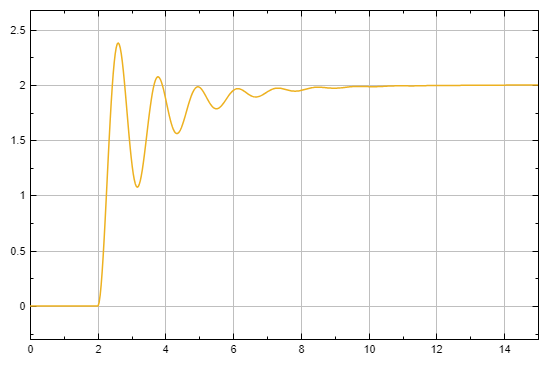

El siguiente paso es pasar el diseno creado en Simulink a HDL usando el flujo
de HDL Coder.

En Simulink se podria generar HDL usando punto flotante (los datos que
MATLAB/Simulink emplean por defecto), pero esto consume muchos mas recursos en
la FPGA y requiere mas ciclos para funcionar. En este ejemplo se utilizo punto
fijo; aun asi, se adjunta la configuracion para punto flotante y una comparacion
de utilizacion.

Para usar punto flotante se abre `HDL Coder` desde la seccion de Apps y se entra
a la configuracion. En `Global settings` se debe colocar un `oversampling` mayor
al valor por defecto (1), por ejemplo 100, aunque en este caso se requiere
alrededor de 78. Ademas, en la configuracion se activa la casilla `Use floating
point`.

Configuracion de oversampling en HDL Coder.

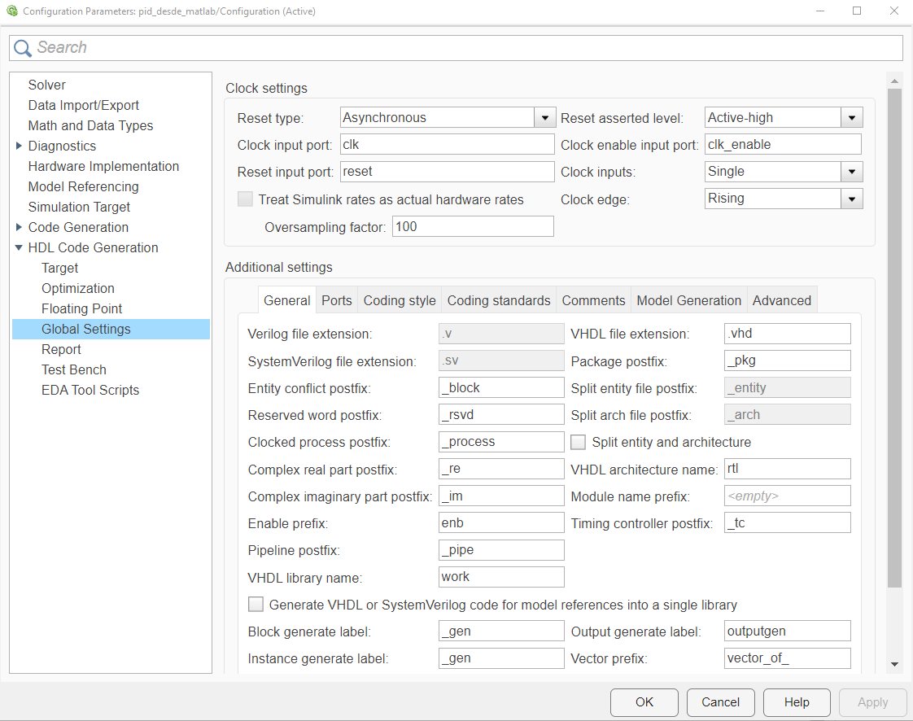

Habilitacion de punto flotante.

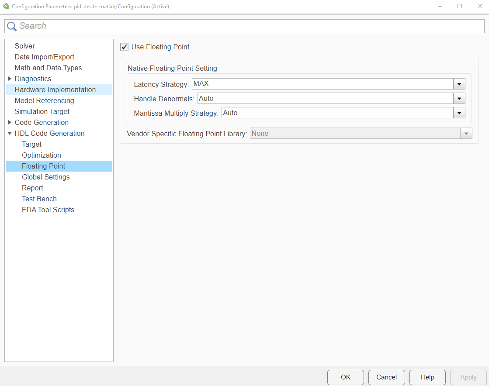

Configuracion para generacion en punto flotante.

Como ejemplo, se muestra la diferencia de utilizacion de recursos entre punto
fijo y punto flotante.

Utilizacion con punto fijo.

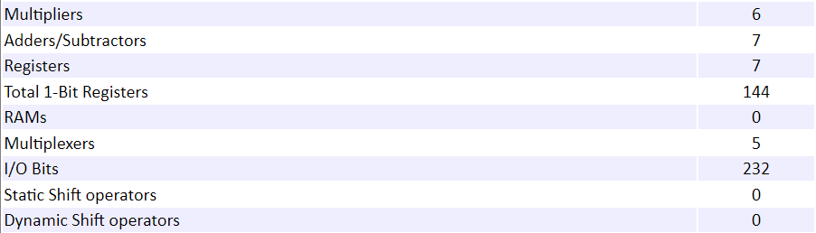

Utilizacion con punto flotante.

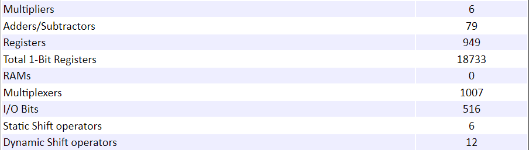

Comparacion de recursos entre punto fijo y punto flotante.

La utilizacion de recursos en punto flotante es mucho mayor que en punto fijo.
Para generar en punto flotante, todos los bloques deben trabajar con tipos
`single` o `double`. En cambio, para que el diseno sea compatible con punto
fijo, todos los bloques deben usar tipos enteros o de punto fijo, como `int`,
`fixdt`, `fi` o `logical`.

Subsystem creado para la generacion de HDL.

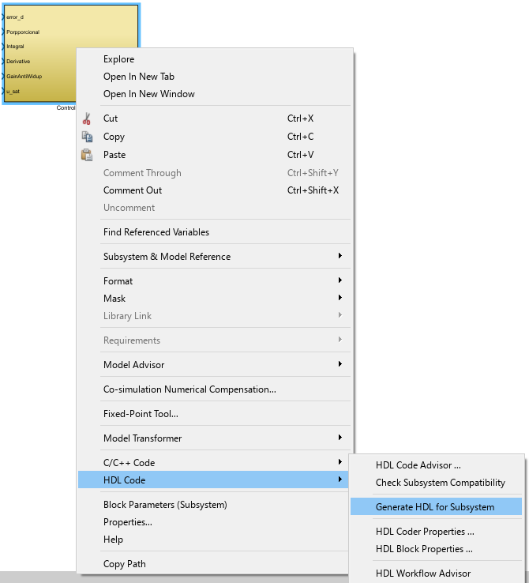

Este paso crea el archivo HDL en la carpeta del proyecto, en
`hdlsrc/ProjectName/Nombre_Bloque.vhd` (o `.v` segun la opcion seleccionada).

Luego, usando el FIL Wizard con una configuracion estandar (sin ajustes
avanzados), como se representa en la siguiente figura, se obtiene el bloque FIL
para este PID.

Bloque FIL generado para el PID.

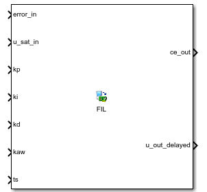

Con el bloque FIL se replica el diagrama de lazo cerrado con los mismos
parametros, y se ejecuta la co-simulacion para observar los resultados.

Lazo cerrado con bloque FIL en co-simulacion.

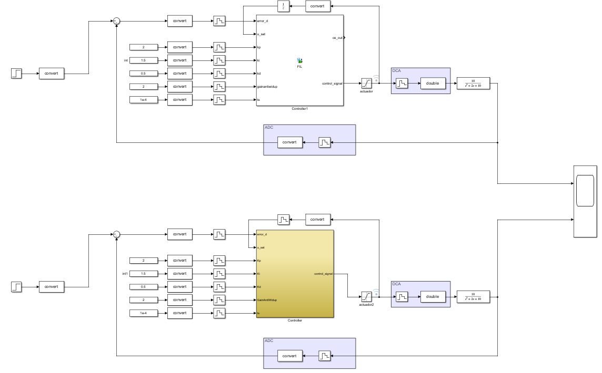

Se obtiene la salida de la planta y la salida del controlador, como se muestra a
continuacion.

Salida de la planta (control).

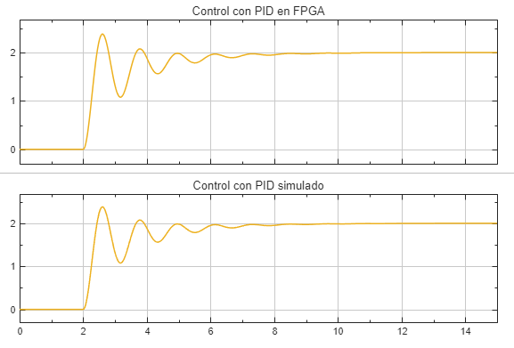

Salida del controlador PID.

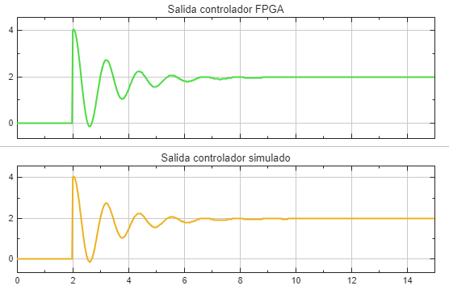

Resultados de co-simulacion del lazo cerrado.

Para demostrar la funcionalidad del anti-windup se realiza una prueba de
seguimiento de referencia a 10 (la saturacion del controlador es de +10 a -10).
Se obtienen los siguientes graficos:

Salida del PID.

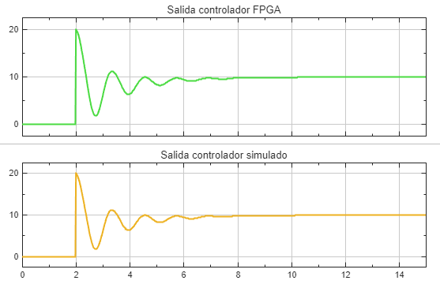

Salida del actuador.

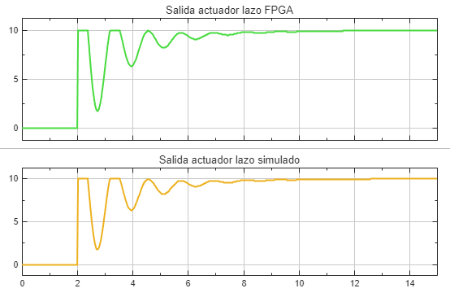

Salida de la planta.

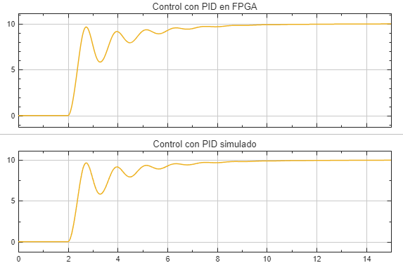

Respuesta en co-simulacion con referencia 10.

Luego se modifica la ganancia de anti-windup a 1 para que tenga un efecto minimo
y se obtienen los siguientes resultados con referencia a 10:

Salida de la planta.

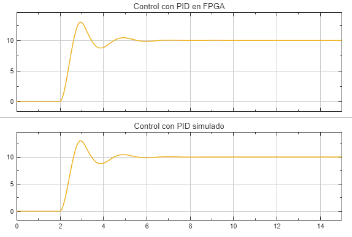

Salida del actuador.

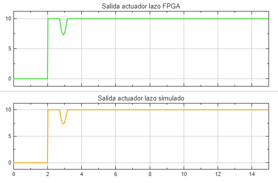

Salida del PID.

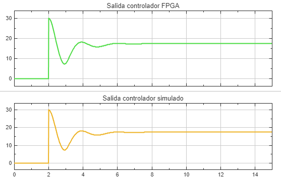

Resultados con anti-windup reducido y referencia 10.

En la salida de la planta se observa un sobreimpulso mayor que 10. En un sistema
real, si el limite es 10 (por espacio, capacidad electrica, angulo, temperatura
u otra restriccion), superar ese valor puede afectar gravemente el
funcionamiento. En este caso el anti-windup cumple una funcion fundamental al
reducir el sobreimpulso y evitar que se exceda el limite. Aumentar el valor del
anti-windup disminuye aun mas el sobreimpulso, pero a cambio hace que la
respuesta sea mas lenta.

Con esto terminado se ha podido verificar el funcionamiento en FPGA de un
controlador PID con anti-windup, con todos sus parametros editables desde
fuera, usando las herramientas MATLAB HDL Verifier y HDL Coder, manteniendo
coherencia entre la simulacion en Simulink y la ejecucion FPGA-in-the-Loop.
