# Ejemplo: producto punto con HDL Coder

Este documento describe el desarrollo del ejemplo de **producto punto** en MATLAB, su validacion con testbench y la generacion de HDL usando HDL Coder. El foco esta en el flujo del ejemplo y sus resultados.

## Diseno y test en MATLAB

El algoritmo base calcula el producto punto entre dos vectores:

```matlab
function p = producto_punto(Vector_a, Vector_b)
% PRODUCTO_PUNTO_VECTORES Calcula el producto punto entre dos vectores

    p = Vector_a.' * Vector_b;

end
```

Luego se realiza un test con multiples casos aleatorios y se guarda una referencia golden:

```
% test_producto_punto_vectores.m
% Test: 1000 casos aleatorios para producto_punto_vectores

rng(0);                % Semilla para reproducibilidad (opcional)
N = 1000;              % Cantidad de ejemplos

% Golden reference (prealocar)
golden.Vector_a = zeros(3, N);
golden.Vector_b = zeros(3, N);
golden.p        = zeros(1, N);

for k = 1:N
    % Vectores 3x1 con valores uniformes entre 0 y 100
    Vector_a = 100 * rand(3,1);
    Vector_b = 100 * rand(3,1);

    p = producto_punto(Vector_a, Vector_b);

    % Guardar entradas y salida
    golden.Vector_a(:, k) = Vector_a;
    golden.Vector_b(:, k) = Vector_b;
    golden.p(k)           = p;
end

% Guardar a archivo .mat
save('golden_reference_producto_punto.mat', 'golden');
```

Guardar entradas y salidas permite reutilizar el mismo conjunto de datos en Simulink, HDL testbench y cosimulacion.

## Configuracion del flujo

### Apertura del Workflow Advisor

El Workflow Advisor puede abrirse desde el icono:


O desde consola con `hdlcoder`, lo que abre esta ventana:


Se presiona **OK** y aparece:

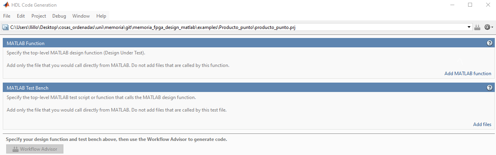

En **Add MATLAB function** se carga la funcion `producto_punto` y en **Add files** se agrega el test. Con esto se continua al **Workflow Advisor**. En este ejemplo se usa **Convert to fixed-point at build time**.

### Fixed-point conversion

En **Define Input Types** basta con ejecutar **Run** para obtener rangos. Luego se entra a **Fixed-Point Conversion**:

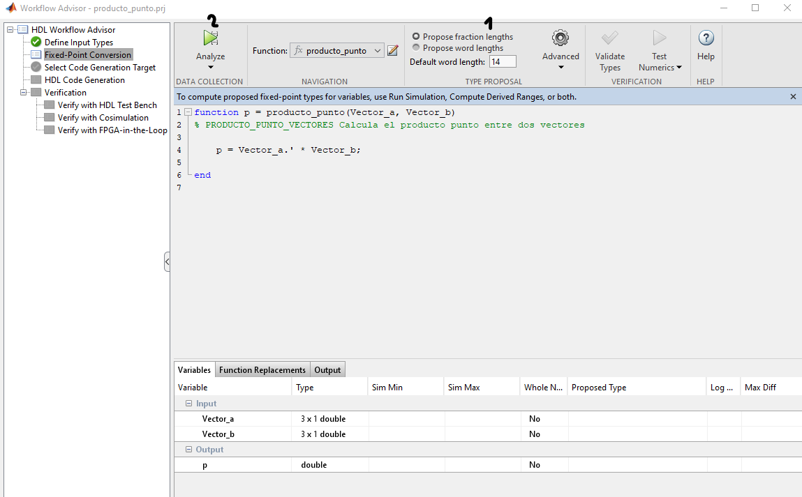

En (1) se selecciona si la recomendacion es por bits o por precision decimal. Si se conoce la precision, se elige esa opcion y se ajusta la cantidad de decimales considerando la formula: TODO poner la formula para pasar de fraction a bits. Luego se presiona **Analyze** (2).

Resultado:

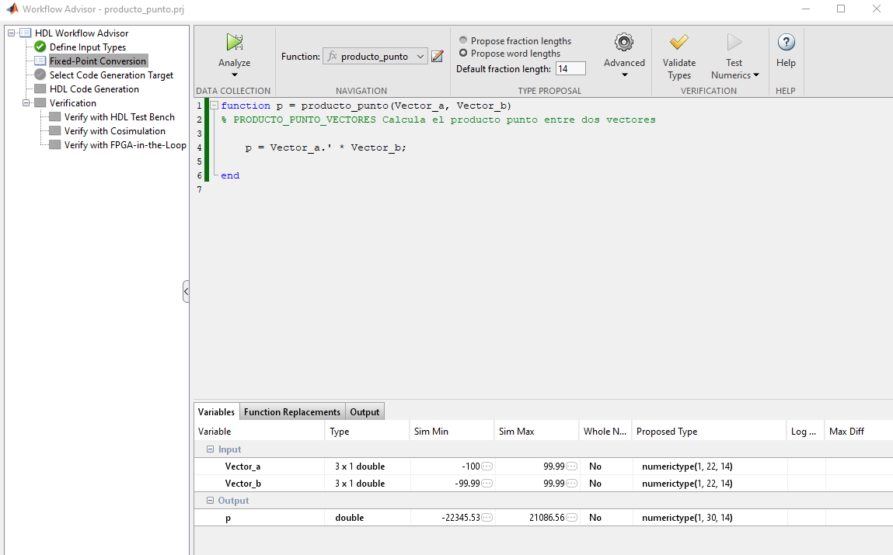

Se observan minimos y maximos de entrada/salida. Al ser un ejemplo simple, se usa un tipo fixed `(1,30,14)` (con signo, 30 bits, 14 fraccionarios). Luego se ejecuta **Validate Types**.

Para validar numericamente se ejecuta **Test Numerics**:


El grafico resultante:


Se observa un error del orden 1e-2, tipico en fixed-point. Si se aumentan bits fraccionarios, el error disminuye.

## Generacion de HDL (fixed-point)

### Con Stream loops

En **HDL Code Generation**:

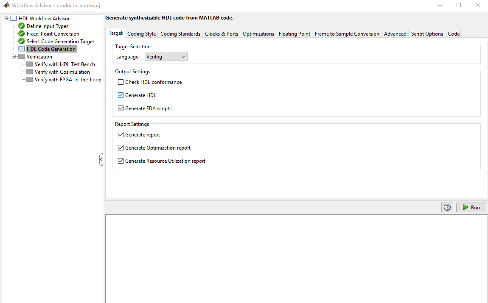

En **Clocks & Ports** se activa **DUT base rate**:


En **Optimization** se activa **Stream loops**:

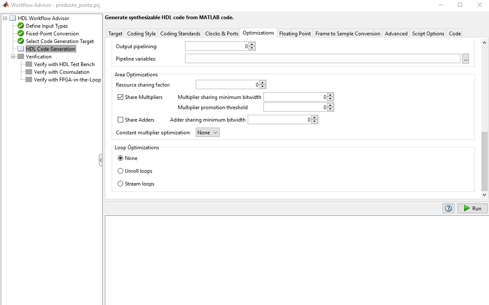

Salida esperada (extracto):

```
### Begin MATLAB to HDL Code Generation...
### Working on DUT: producto_punto_fixpt.
### Using TestBench: test.
### The DUT requires an initial pipeline setup latency. Each output port experiences these additional delays.
### Output port 1: 1 cycles.
 ### MESSAGE: The design requires 3 times faster clock with respect to the base rate = 1.
### Working on producto_punto_fixpt_tc as producto_punto_fixpt_tc.v.
### Begin Verilog Code Generation
### Working on producto_punto_fixptp3 as producto_punto_fixptp3.v.
### Working on producto_punto_fixpt as producto_punto_fixpt.v.
### Generating Resource Utilization Report resource_report.html.
 ### Generating Optimization report  
 ### To rerun codegen evaluate the following commands...

---------------------
cgi    = load('codegen\producto_punto\hdlsrc\codegen_info.mat');
cfg    = cgi.CodeGenInfo.codegenSettings;
fxpCfg = cgi.CodeGenInfo.fxpCfg;
codegen -float2fixed fxpCfg -config cfg -report
---------------------

 ### Generating HDL Conformance Report producto_punto_fixpt_hdl_conformance_report.html.
### HDL Conformance check complete with 0 errors, 1 warnings, and 1 messages.
 ### Code generation successful: View report
### Elapsed Time: '         15.2745' sec(s)
```

- `Output port 1: 1 cycles.` indica un desfase de 1 ciclo entre entrada y salida.
- `MESSAGE: The design requires 3 times faster clock...` indica comparticion de recursos por **Stream loops**.
- `Generating Resource Utilization Report` permite verificar si el diseno cabe en la FPGA.

Reporte de recursos:

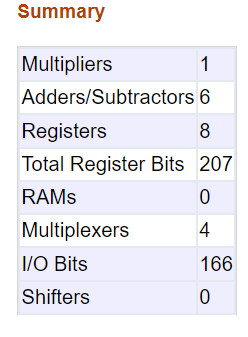

### Sin Stream loops

Con **Stream loops** desactivado:

```
### Begin MATLAB to HDL Code Generation...
### Working on DUT: producto_punto_fixpt.
### Using TestBench: test.
### Begin Verilog Code Generation
### Working on producto_punto_fixpt as producto_punto_fixpt.v.
### Generating Resource Utilization Report resource_report.html.
### Generating Optimization report  
### To rerun codegen evaluate the following commands...

---------------------
cgi    = load('codegen\producto_punto\hdlsrc\codegen_info.mat');
cfg    = cgi.CodeGenInfo.codegenSettings;
fxpCfg = cgi.CodeGenInfo.fxpCfg;
codegen -float2fixed fxpCfg -config cfg -report
---------------------

### Generating HDL Conformance Report producto_punto_fixpt_hdl_conformance_report.html.
### HDL Conformance check complete with 0 errors, 0 warnings, and 0 messages.
 ### Code generation successful: View report
### Elapsed Time: '            5.1107' sec(s)
```

No aparece el mensaje de ciclos ni el requerimiento de reloj, ya que el HDL queda combinacional. En ejemplos pequeños la diferencia de recursos es baja, pero en iteraciones grandes es necesario compartir recursos para que el diseno quepa en FPGA.

## Generacion en punto flotante

En el **HDL Workflow Advisor** se selecciona **Keep original types**:


Luego se configuran estas opciones en orden:

1) **Optimization**: activar **Aggressive Dataflow Conversion**.

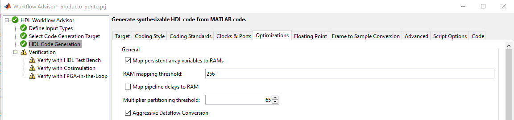

2) **Advanced**: **None** en **Check for presence of reals in the generated code**.

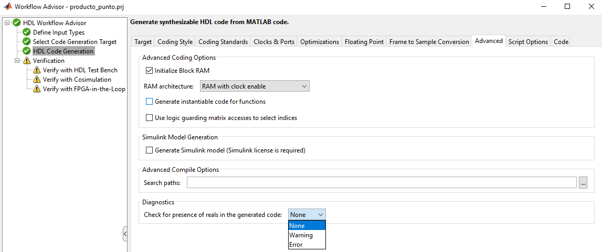

3) **Floating Point**: activar **Use floating point** y seleccionar **NativeFloatingPoint**.


Salida esperada con **Stream loops** activado:

```
### Begin MATLAB to HDL Code Generation...
### Working on DUT: producto_punto.
### Using TestBench: test.
### The DUT requires an initial pipeline setup latency. Each output port experiences these additional delays.
### Output port 1: 26 cycles.
 ### MESSAGE: The design requires 3 times faster clock with respect to the base rate = 1.
### Working on producto_punto_tc as producto_punto_tc.v.
### Begin Verilog Code Generation
### Working on producto_punto/nfp_mul_double as nfp_mul_double.v.
### Working on producto_punto/nfp_add_double as nfp_add_double.v.
### Working on producto_punto as producto_punto.v.
### Generating Resource Utilization Report resource_report.html.
### Generating Optimization report  
### To rerun codegen evaluate the following commands...

---------------------
cgi    = load('codegen\producto_punto\hdlsrc\codegen_info.mat');
inVals = cgi.CodeGenInfo.inVals;
cfg    = cgi.CodeGenInfo.codegenSettings;
codegen -config cfg -args inVals -report
---------------------

### Generating HDL Conformance Report producto_punto_hdl_conformance_report.html.
### HDL Conformance check complete with 0 errors, 0 warnings, and 1 messages.
 ### Code generation successful: View report
### Elapsed Time: '         14.5892' sec(s)
```

`Output port 1: 26 cycles` indica una latencia mayor, aunque el throughput se mantiene.

Uso de recursos:

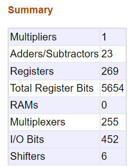

Se observa aumento notable de recursos respecto a fixed-point, pero sigue siendo factible en este ejemplo.

## Verificacion del HDL y cosimulacion

### Verify with HDL Test Bench

Se activan las casillas y se selecciona la herramienta de simulacion. Si no aparece, debe agregarse al `path`. Ejemplo para Vivado 2023.1:

```
hdlsetuptoolpath('ToolName','Xilinx Vivado','ToolPath','C:\Xilinx\Vivado\2023.1\bin\vivado.bat');
```

Luego **Refresh List** y **Run**. Si falla, suele indicar HDL mal formado; se recomienda revisar el reporte y ajustar opciones.

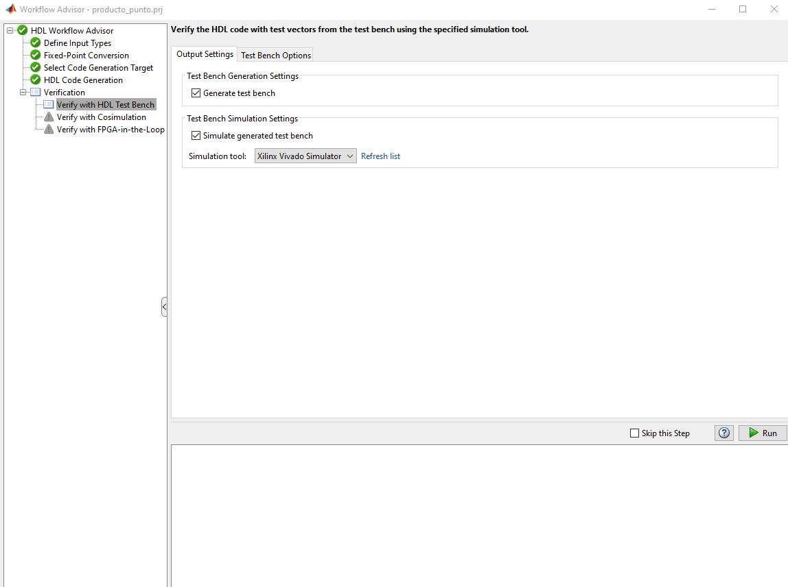

### Verify with Cosimulation

En cosimulacion se comparan salidas del testbench con las del modelo. Si el codigo MATLAB no es HDL-friendly, pueden aparecer diferencias: TODO linkear el ejemplo. Esta etapa no soporta `double` ni `single`.


Grafico resultante:

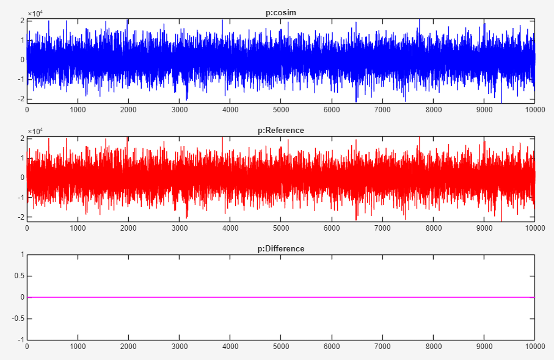

El error es 0 para los datos testeados. Datos fuera del rango probado pueden producir salidas incorrectas.

### Verify with FPGA-in-the-Loop (FIL)

Se activan las casillas, se configura la conexion y se ejecuta **Run**. Esta etapa es lenta porque se sintetiza, implementa, genera bitstream y se programa la FPGA.

Si Vivado falla por longitud de `path` (mas de 260 caracteres), se recomienda mover el proyecto cerca de la raiz del disco.

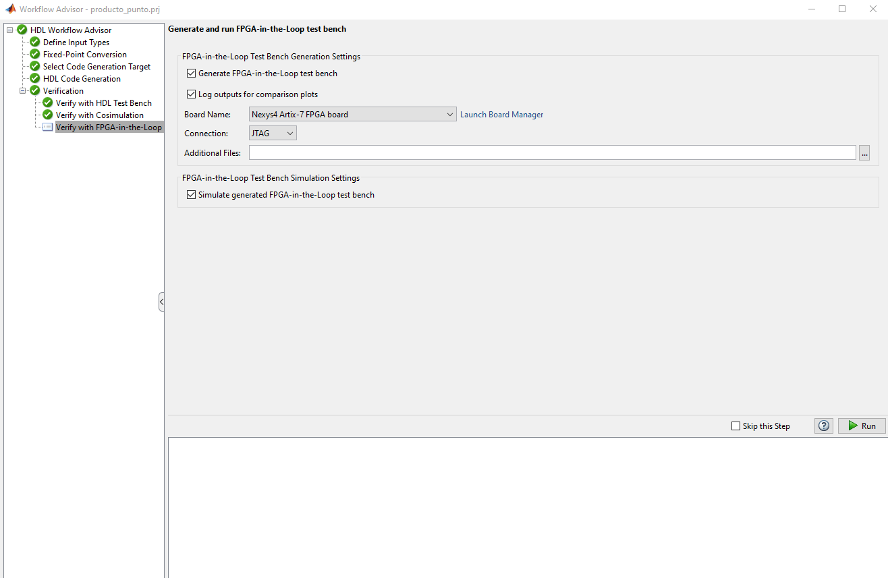

Grafico final:


No se observa error para los datos de prueba. Recordar que en fixed-point existe perdida de precision del orden de 1e-2, aunque aqui se compara contra la version fixed-point y no contra el test original.

Con el flujo completado, se puede ir a `codegen\nameproyect\hdlsrc` y usar los archivos `.v` (o el lenguaje elegido). Tambien es posible continuar en Simulink con **FIL Wizard** para probar nuevos valores: TODO linkear.

Para la comparacion final entre la salida de MATLAB y la salida de la FPGA con bitstream cargado, se requiere tener configurada la conexion con la FPGA. Guia: TODO adjuntar el link.
