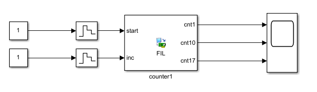
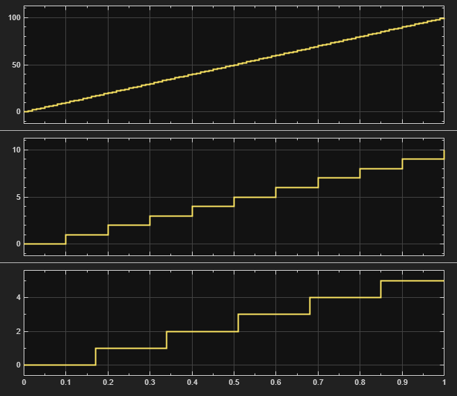
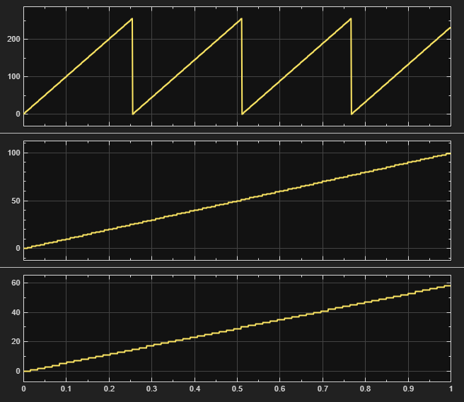
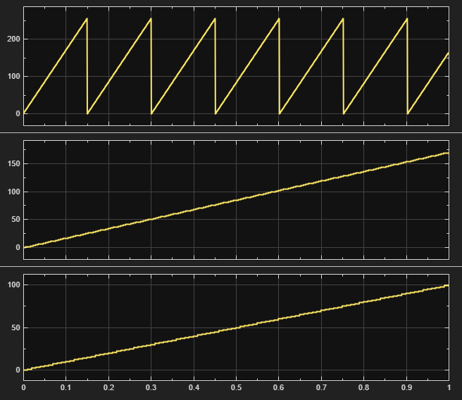

En este ejemplo se documenta la verificacion de un modulo Verilog sencillo con FPGA-in-the-Loop (FIL).
El diseno es un contador con una entrada `start` que habilita el conteo y salidas con ritmos distintos.
El objetivo es mostrar como el overclocking factor (OF) afecta el muestreo en Simulink.

El overclocking factor se define como la razon entre el reloj del FPGA y el tiempo de muestreo de Simulink.
Para un muestreo de Simulink $T_s$:

$$
f_{FPGA} = \frac{OF}{T_s}
\qquad
T_{FPGA} = \frac{T_s}{OF}
$$

Esto implica que el FPGA muestrea las entradas OF veces por cada paso de Simulink y la salida observada
ya acumula esos ciclos internos.

## Caso contador

El modulo `counter` recibe `clk`, `rst`, `start` e `inc`. Internamente implementa un contador base y
divisores que generan pulsos a distintos periodos. Las salidas son contadores de 8 bits:

- `cnt1`: incrementa cada ciclo con `start` activo.
- `cnt10`: incrementa cada 10 ciclos.
- `cnt17`: incrementa cada 17 ciclos.
- `cnt25`: incrementa cada 25 ciclos y usa registros extra en la ruta.

El proposito es observar como el OF interactua con las distintas frecuencias internas.

## Configuracion experimental

Se genera el bloque FIL con `FIL Wizard` usando `counter.v` y se integra en Simulink con fuentes y scopes.

El muestreo de entradas se fija en $T_s = 1\times 10^{-2}$ s. Se prueban varios valores de OF en un
horizonte de 1 segundo.

## Resultados

Bloque FIL generado:

Comparacion de salidas para distintos factores de overclocking:

| OF = 1 | OF = 10 | OF = 17 |
| --- | --- | --- |
|  |  |  |

Resumen en 1 segundo:
- `OF = 1`: `cnt1` llega a 100; `cnt10` y `cnt17` quedan por debajo.
- `OF = 10`: `cnt10` llega a 100; `cnt1` supera 100; `cnt17` no llega.
- `OF = 17`: `cnt17` llega a 100; `cnt1` y `cnt10` superan 100.

## Conclusiones

El OF debe elegirse segun la frecuencia interna del modulo observado.
Si el diseno no limita su acumulacion interna, un OF alto produce valores observados mayores a los esperados.
Tambien aparece una cuantizacion temporal cuando la salida del FPGA se actualiza a un ritmo distinto al muestreo de Simulink.
