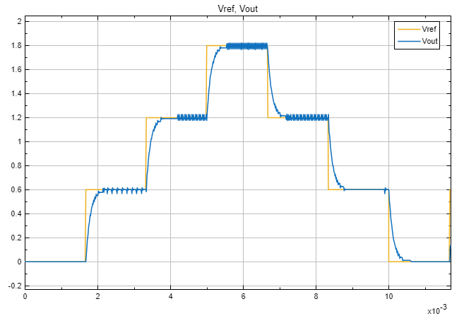
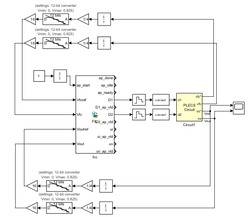
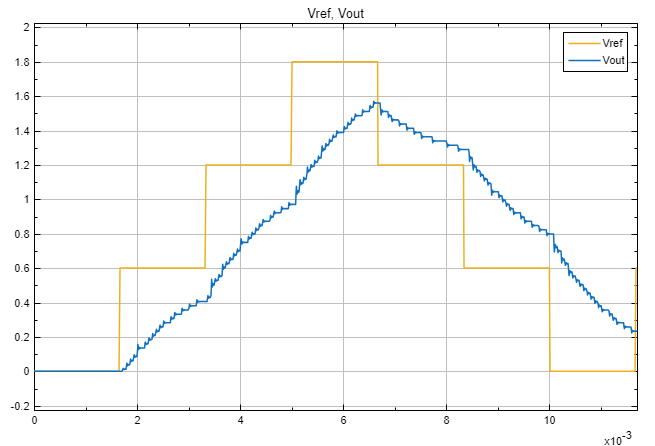
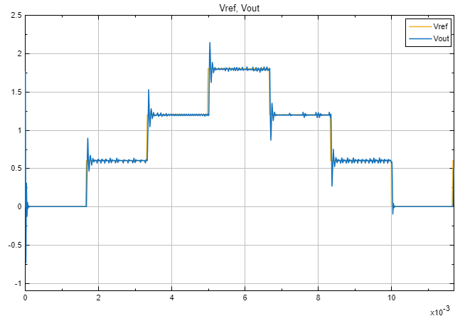

Este ejemplo muestra el impacto del overclocking en un controlador PI sintetizado a HDL y probado con FPGA-in-the-Loop (FIL).
La parte integral acumula el error, por lo que el sobremuestreo o el muestreo insuficiente cambia el comportamiento.

El overclocking factor (OF) es la razon entre la frecuencia del FPGA y el paso de Simulink.
Para un muestreo $T_s$:

$$
f_{FPGA} = \frac{OF}{T_s}
\qquad
T_{FPGA} = \frac{T_s}{OF}
$$

## Modelo base en Simulink

Se parte de un modelo con una funcion MATLAB que implementa el PI en lazo cerrado.
La respuesta base sigue la referencia con el muestreo esperado.

| Diagrama base del PI | Respuesta del PI base |
| --- | --- |
|  |  |

En este ejemplo, las entradas estan discretizadas a $6.5\times 10^{-6}$ s.
Al estar todas las entradas discretizadas se puede usar el solver en modo automatico pero con `variable step`,
porque PLECS no permite `discrete`. El bloque PLECS es continuo, por lo que se usa un `Zero-Order Hold` para
enlazar con el bloque FIL discreto. La salida de la FPGA y la entrada de PLECS tienen distinto ancho de palabra,
asi que se usa un `Data Type Conversion` a `int8`.

## Bloque FIL y configuracion de overclocking

El controlador se sintetiza con Vitis y se genera el bloque FIL con `FIL Wizard`.
El HDL generado incluye senales de control; en este caso no se usan, pero se recomiendan para un diseno mas seguro.
Por ejemplo, con el overclocking por defecto de 1, la senal `D1_ap_vld` indica que `D1` esta lista con una
frecuencia de $7.15\times 10^{-5}$ s, que es 11 veces la frecuencia de entrada $6.5\times 10^{-6}$ s. De aqui se
infiere que se necesita un overclocking de 11, porque se requieren 11 ciclos internos para obtener una salida
por cada $6.5\times 10^{-6}$ s, que es el ritmo para el cual fue disenado el controlador.
El diagrama de simulacion con FIL es:

## Resultados

Se evaluan tres factores de overclocking: `OF = 1`, `OF = 11` y `OF = 75`.

| OF = 1 | OF = 11 | OF = 75 |
| --- | --- | --- |
|  |  |  |

Resumen:
- `OF = 1`: el controlador no logra el desempeno esperado porque el diseno requiere 11 ciclos internos.
- `OF = 11`: la respuesta coincide con la referencia.
- `OF = 75`: hay sobremuestreo, con sobreimpulsos mas pronunciados y mayor tiempo de estabilizacion.
