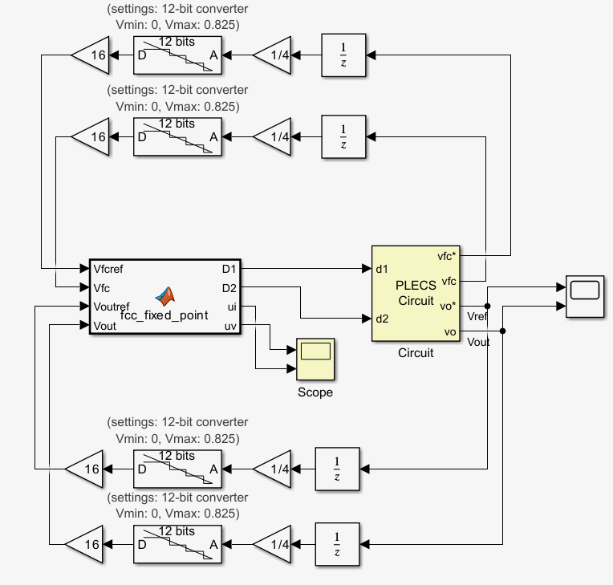
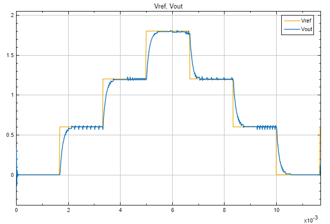

# Ejemplo: controlador PI con FPGA-in-the-Loop y análisis de overclocking

Este ejemplo muestra el impacto del `overclocking factor` sobre un controlador PI sintetizado a HDL y validado mediante FPGA-in-the-Loop (FIL). La parte integral del controlador acumula el error, por lo que tanto el sobremuestreo como el submuestreo modifican de forma significativa la respuesta del sistema.

Además del flujo generado desde MATLAB, este ejemplo también incorpora la prueba de un HDL desarrollado externamente y luego integrado al entorno de validación. Esto demuestra que la infraestructura basada en Simulink y FIL no solo sirve para diseños producidos con `HDL Coder`, sino también como banco de pruebas para módulos RTL escritos fuera de MATLAB. La carpeta `HDL_original/` conserva esa versión externa como referencia del experimento.

## Objetivo

Determinar cómo debe configurarse el OF para que el bloque FIL reproduzca en Simulink el comportamiento temporal esperado del controlador PI.

## Concepto de overclocking

El `overclocking factor` (OF) es la razón entre la frecuencia de reloj de la FPGA y el paso de simulación en Simulink. Para un tiempo de muestreo $T_s$:

$$
f_{FPGA} = \frac{OF}{T_s}
\qquad
T_{FPGA} = \frac{T_s}{OF}
$$

En la práctica, esto determina cuántos ciclos internos de FPGA se ejecutan por cada muestra visible en Simulink.

## Modelo base en Simulink

El punto de partida es un modelo con una función MATLAB que implementa el PI en lazo cerrado. Este modelo se usa como referencia para comparar la versión HDL/FIL.

| Diagrama base del PI | Respuesta del PI base |
| --- | --- |
|  |  |

En este ejemplo, las entradas están discretizadas a $6.5\times10^{-6}$ s. Como PLECS no permite usar un solver puramente discreto en este contexto, la simulación se ejecuta en modo automático con `variable step`. Dado que el bloque PLECS es continuo y el bloque FIL es discreto, se utiliza un `Zero-Order Hold` para enlazarlos correctamente. Además, la salida de la FPGA y la entrada de PLECS manejan anchos de palabra distintos, por lo que se añade una conversión a `int8`.

## Generación del bloque FIL y configuración del OF

El controlador se sintetiza con Vitis y luego se genera el bloque FIL mediante `FIL Wizard`.

El HDL producido incluye señales de control. En este ejemplo no se usan directamente, pero son útiles para validar el comportamiento temporal del diseño. Por ejemplo, con el valor por defecto `OF = 1`, la señal `D1_ap_vld` indica que `D1` está lista con una frecuencia de $7.15\times10^{-5}$ s, mientras que la entrada opera a $6.5\times10^{-6}$ s. Esto permite inferir que el diseño necesita 11 ciclos internos por cada muestra de entrada, por lo que el valor adecuado es `OF = 11`.

Dicho de otro modo, si el controlador fue diseñado para producir una salida útil cada $6.5\times10^{-6}$ s, entonces el bloque FIL debe disponer de suficientes ciclos internos para completar ese cálculo dentro del paso de simulación visible.

Diagrama de simulación con el bloque FIL:

## Resultados

Se evalúan tres factores de overclocking: `OF = 1`, `OF = 11` y `OF = 75`.

| OF = 1 | OF = 11 | OF = 75 |
| --- | --- | --- |
|  |  |  |

Resumen:

- `OF = 1`: el controlador no reproduce el desempeño esperado porque el diseño necesita más ciclos internos de los que Simulink le entrega por muestra.
- `OF = 11`: la respuesta coincide con la referencia, ya que el ritmo de cálculo interno queda alineado con el tiempo de diseño.
- `OF = 75`: aparece sobremuestreo; la respuesta presenta sobreimpulsos más marcados y un tiempo de estabilización mayor.

## Conclusiones

El comportamiento del controlador PI en FIL depende directamente del número de ciclos internos disponibles por cada muestra de Simulink. Un OF insuficiente impide completar el cálculo interno a tiempo, mientras que un OF excesivo altera la dinámica del integrador y degrada la respuesta.

En este caso, `OF = 11` es el valor que mejor reproduce el comportamiento esperado del controlador.
