En este ejemplo se documenta el flujo para llevar una Spiking Neural Network (SNN) desde MATLAB a HDL y validarla con FPGA-in-the-Loop (FIL).
Se modela una SNN simple para MNIST, se generan pesos en Python y se implementa el core en MATLAB.
Luego se convierte a punto fijo con HDL Coder, se genera HDL y se verifica con HDL Verifier.

## Introduccion a las SNN

Las SNN procesan informacion mediante spikes (eventos discretos en el tiempo). El computo solo ocurre
cuando hay un spike, lo que habilita un modelo asincrono y eficiente en energia.

Ventajas principales:
- Alta eficiencia energetica al operar por eventos.
- Procesamiento temporal nativo.
- Computacion asincrona sin reloj global.
- Implementacion eficiente en hardware neuromorfico.

Aplicaciones tipicas:
- Vision por eventos.
- Robotica autonoma.
- Procesamiento de senales temporales.
- Sistemas embebidos de bajo consumo.

## Modelo matematico base

Sea $s_i(t) \in \{0,1\}$ el spike de la sinapsis $i$ y $w_i$ su peso.

Entrada sinaptica (suma condicionada):
$$
I(t) = \sum_{i:\,s_i(t)=1} w_i
$$

Dinamica y disparo:
$$
V(t) = V(t-1) + I(t)
$$
$$
y(t) =
\begin{cases}
1 & \text{si } V(t) \ge \theta \\
0 & \text{si } V(t) < \theta
\end{cases}
$$

## Caso de prueba: SNN simple para MNIST

Se usa una arquitectura minima:
- 784 neuronas de entrada (28x28).
- 10 neuronas de salida (clases 0-9).

El objetivo es validar el flujo completo, no maximizar rendimiento.

## Implementacion en MATLAB

La funcion `snn.m` recorre cada neurona de salida, acumula solo los pesos con spikes activos y compara contra un umbral comun.

```matlab
function spikes_out = snn(spikes_in)
    % SNN  Computa la salida de una red neuronal de disparos binaria.

    params = snn_params();
    W = params.W;            % Matriz de pesos MxN (M entradas, N salidas)
    thresh = params.thresh;  % Umbral de disparo para cada neurona de salida

    [M, N] = size(W);        % M=784, N=10 (por ejemplo)

    spikes_out = fi(0, 0, N, 0);

    for j = 1:N
        acc = 0;
        for i = 1:M
            if bitget(spikes_in, M - i + 1)
                acc = acc + W(i,j);
            end
        end
        if acc >= thresh
            spikes_out = bitset(spikes_out, N - j + 1, 1);
        end
    end
end
```

Parametros y pesos en `snn_params.m` (autogenerado):

```matlab
function params = snn_params()
% Autogenerado por generate_hdl.m
params.thresh = 1 ;
params.beta = 1;
params.W = [ ...
  -0.14369439 0.00000000 -0.00000000 -0.10920773 -0.00000000 ...
  -0.10345996 0.00000000 0.00000000 -0.11495551 -0.29313657 ...
  ...]
```

## Empaquetado de entradas para FIL

En FIL, los puertos vectoriales se scalarizan. Para evitar 784 puertos, se usa un bus empaquetado `ufix784`.
El banco de pruebas toma `spike_train.mem`, empaqueta cada frame y ejecuta la SNN frame a frame.

```matlab
mem_file = 'spike_train.mem';

fid = fopen(mem_file, 'r');
if fid < 0, error('No pude abrir %s', mem_file); end
C = textscan(fid, '%s', 'Delimiter','\n');
fclose(fid);
frames = C{1};

char_mat   = char(strtrim(frames));
frames_mat = (char_mat == '1');

packed_in = fi(zeros(num_frames,1), 0, 784, 0);

for i = 1:784
    packed_in = bitset(packed_in, 784 - i + 1, frames_mat(:, i));
end
in_ts = timeseries(packed_in, (0:num_frames-1)'*0.1);

for f = 1:num_frames
    out = snn(packed_in(f));
    fprintf('Frame %d -> %s\n', f, bin(out));
end
```

## Generacion de HDL con HDL Coder

El flujo se realiza con Workflow Advisor, cargando `snn.m` como DUT y el testbench en MATLAB.

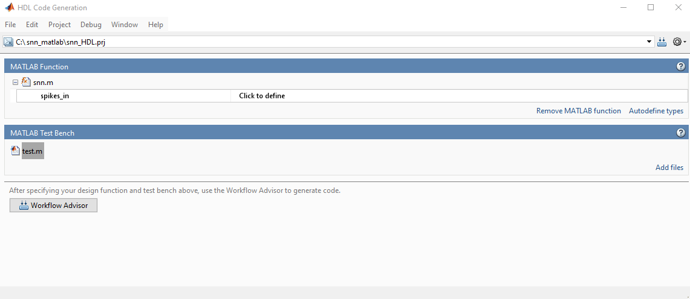

### Conversion a punto fijo

Se usa `Convert to fixed point`, `Propose fraction lengths` y `Saturate` para evitar overflow/underflow.

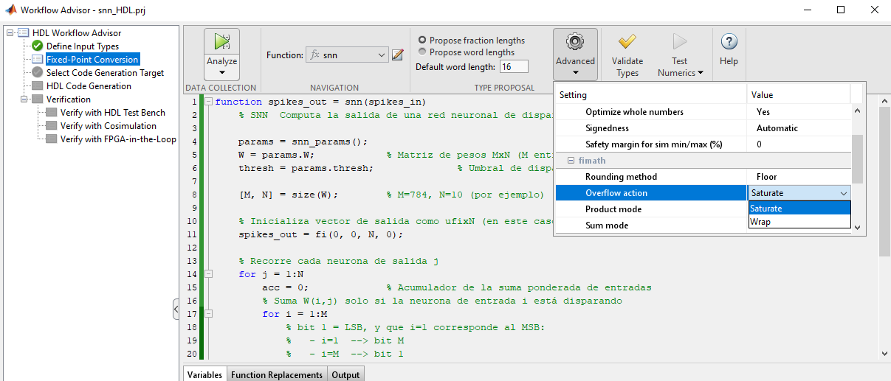
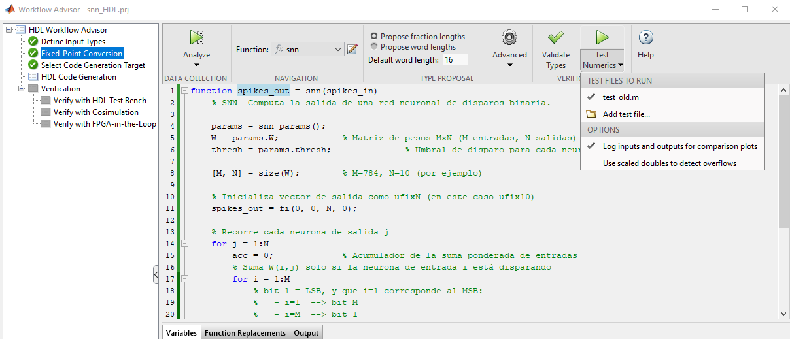

La comparacion flotante vs fijo muestra 1 frame distinto; se corrige aumentando bits.

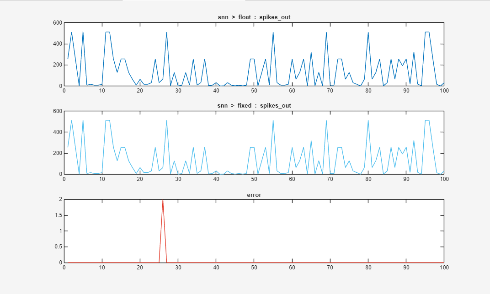

### Configuracion y optimizacion

Se recomienda generar en Verilog y activar reportes.
En `Optimization` se usa `Stream Loop` para compartir recursos entre iteraciones.

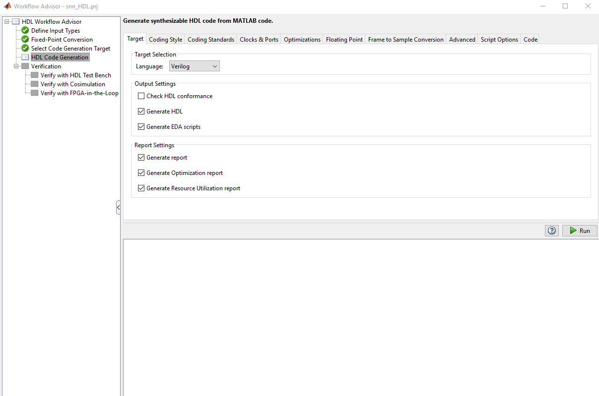
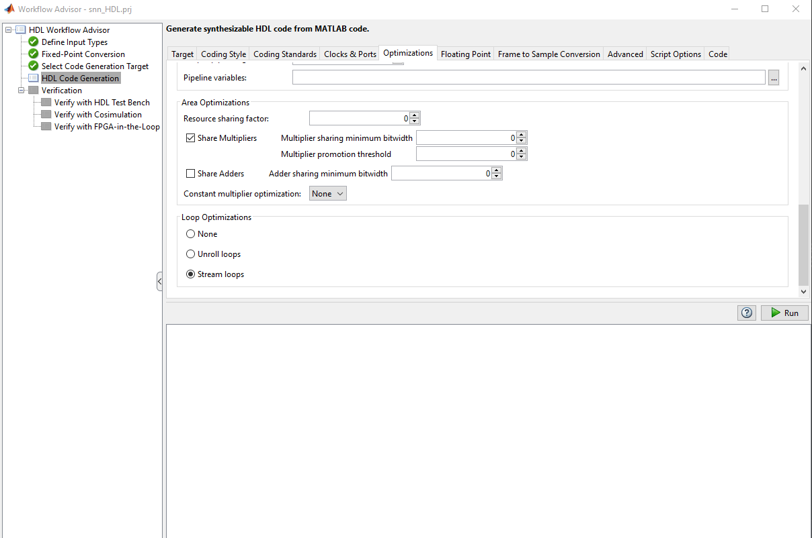
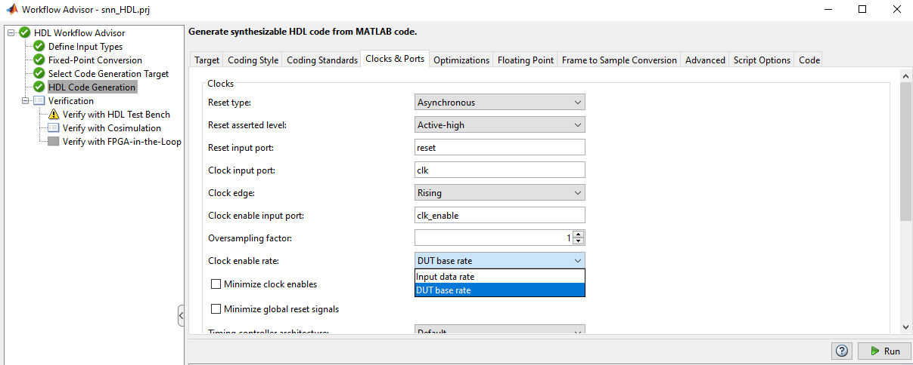

Impacto en recursos:

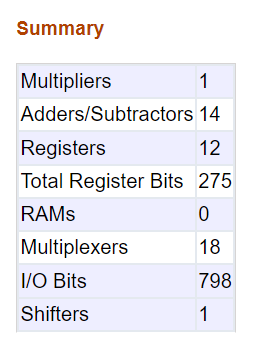
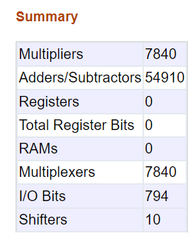

### Salida de generacion y logs

El log indica latencia fija de 1 ciclo y necesidad de un reloj 7840x mayor:

```text
### Begin MATLAB to HDL Code Generation...
### Working on DUT: snn_fixpt.
### Using TestBench: test_old.
### The DUT requires an initial pipeline setup latency. Each output port experiences these additional delays.
### Output port 1: 1 cycles.
### MESSAGE: The design requires 7840 times faster clock with respect to the base rate = 1.
...
```

Interpretacion:
- Latencia fija de 1 ciclo.
- Reloj interno 7840x.
- En FIL se configura oversampling a 7840.

## Verificacion

### Co-simulacion (HDL Verifier)

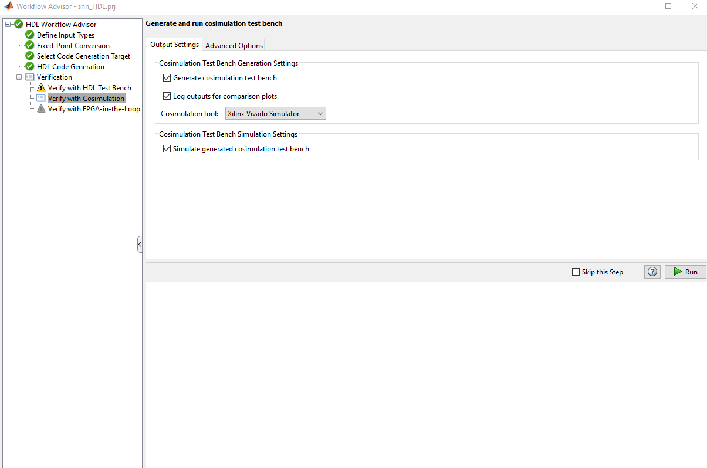

Configurar el simulador (ejemplo Vivado):

```matlab
hdlsetuptoolpath('ToolName','Xilinx Vivado','ToolPath','C:\Xilinx\Vivado\20xx.x\bin\vivado.bat');
```

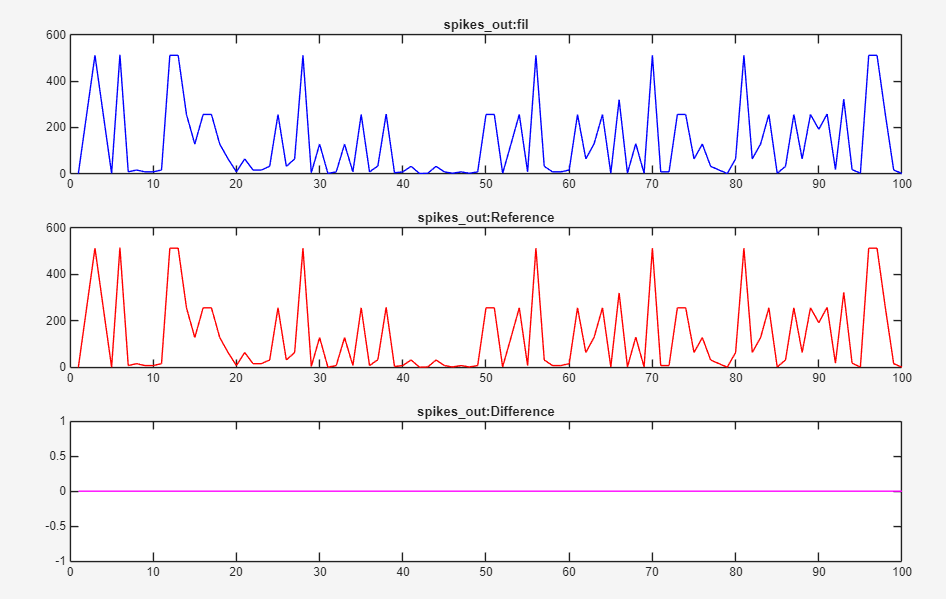

### FPGA-in-the-Loop (FIL)

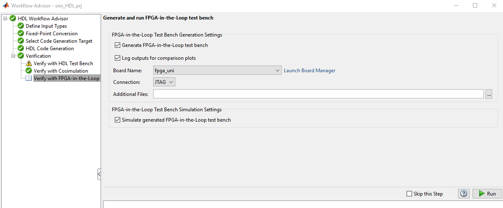
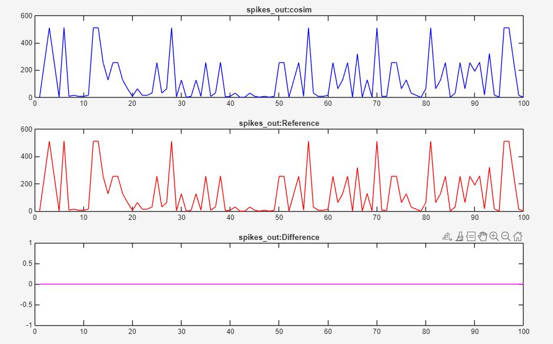

Se recomienda aumentar el numero de frames de prueba para mayor confianza.

## Verificacion en Simulink

Se integra el bloque FIL y se configura oversampling 7840 con retardo de 1 ciclo.

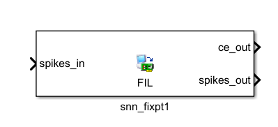
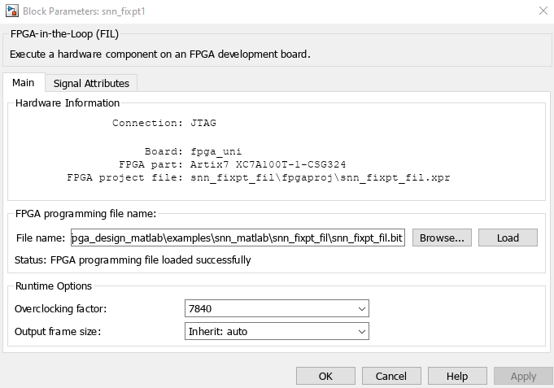

Durante el test se usa `in_ts` y se activa logging de salida.


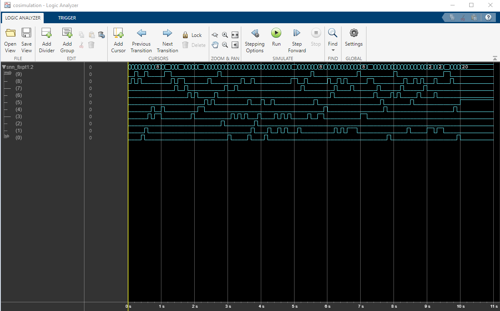

Comparacion con retardo de 1 ciclo:

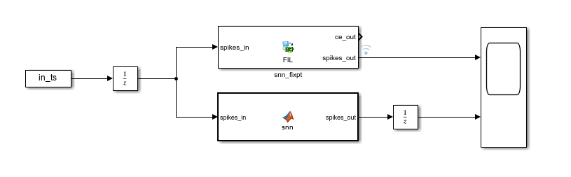
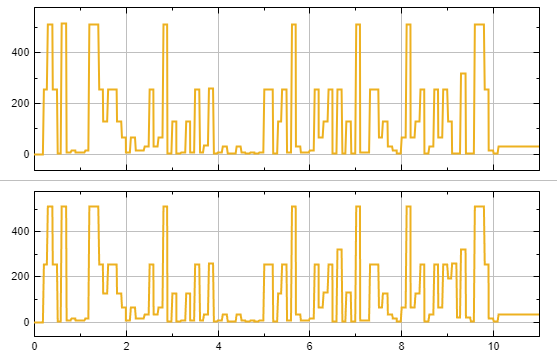

### Prueba con Computer Vision Toolbox (opcional)

```matlab
function packed = image_to_packed_latency_ufix784(img, latency_threshold)

    if nargin < 2 || isempty(latency_threshold)
        latency_threshold = 0.5;
    end

    if ~isa(img, 'double')
        img = double(img);
    end

    if ndims(img) == 3
        if ~isequal(size(img), [28 28 3])
            error('La imagen debe ser 28x28x3.');
        end
        img_gray = rgb2gray(img / max(255, max(img(:))));
    else
        if ~isequal(size(img), [28 28])
            error('La imagen debe ser 28x28.');
        end
        img_gray = img / max(255, max(img(:)));
    end

    spikes = (img_gray.' > latency_threshold);

    packed = fi(0, 0, 784, 0);
    for i = 1:784
        packed = bitset(packed, 784 - i + 1, spikes(i));
    end
end
```

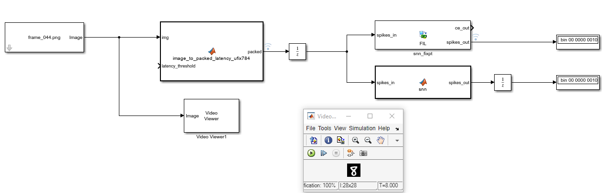

## Resultados y conclusiones

Pendiente completar un resumen de metricas y hallazgos finales al validar la SNN en hardware.
